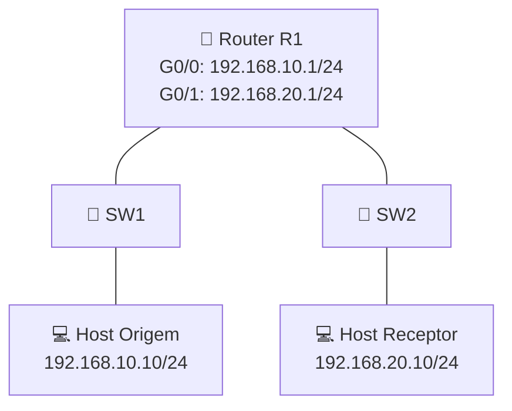

# Atividade 03 - PIM-DM em topologia controlada

**Disciplina:** ENE0025 - Protocolos de Transporte e Roteamento  
**Professor responsável:** Prof. Dr. Laerte Peotta de Melo  
**Monitores:** Victor Lima dos Santos / Beatriz Silva Nascimento

---

## 1. Tema da atividade

Implementação inicial de **multicast IP com PIM-DM** em uma topologia pequena e controlada no **PNetLab**, validando a formação básica do encaminhamento multicast entre uma origem e um receptor em duas LANs distintas.

---

## 2. Justificativa didática

Esta prática introduz o aluno ao roteamento multicast em ambiente controlado. Após a configuração básica de interfaces e conectividade IP em laboratório anterior, o estudante passa a observar:

- tráfego **unicast** como base para o funcionamento do multicast;
- habilitação de **multicast routing** no roteador;
- ativação do **PIM Dense Mode (PIM-DM)**;
- formação da tabela de rotas multicast;
- encaminhamento de tráfego multicast entre redes diferentes.

A atividade foi estruturada para simplificar o primeiro contato com multicast roteado.

---

## 3. Objetivos

Ao final desta atividade, o aluno deverá ser capaz de:

- montar uma topologia controlada de multicast no **PNetLab**;
- configurar interfaces IP em roteador e hosts;
- habilitar o roteamento multicast com `ip multicast-routing`;
- ativar o **PIM-DM** nas interfaces do roteador;
- gerar tráfego multicast de teste;
- verificar a operação básica do encaminhamento multicast;
- analisar a relação entre a tabela unicast e a tabela multicast;
- validar o funcionamento do grupo multicast configurado.

---

## 4. Topologia proposta



---

## 5. Endereçamento IP

| Dispositivo   | Interface | Endereço IP   | Máscara           | Gateway         |
|---------------|-----------|---------------|-------------------|-----------------|
| R1            | G0/0      | 192.168.10.1  | 255.255.255.0     | —               |
| R1            | G0/1      | 192.168.20.1  | 255.255.255.0     | —               |
| Host Origem   | eth0      | 192.168.10.10 | 255.255.255.0     | 192.168.10.1    |
| Host Receptor | eth0      | 192.168.20.10 | 255.255.255.0     | 192.168.20.1    |

**Grupo multicast sugerido:** `239.1.1.1`  
**Porta UDP de teste:** `5000`

---

## 6. Montagem do cenário no PNetLab

### 6.1 Dispositivos necessários

Adicionar ao laboratório os seguintes nós:

- **1 roteador Cisco** com suporte a multicast;
- **2 switches Ethernet**;
- **2 hosts**, preferencialmente Linux leves.

### 6.2 Conexões da topologia

Realizar as conexões conforme abaixo:

- conectar o **Host Origem** ao **SW1**;
- conectar o **SW1** à interface **G0/0** do **R1**;
- conectar o **Host Receptor** ao **SW2**;
- conectar o **SW2** à interface **G0/1** do **R1**.

### 6.3 Resultado esperado da montagem

Ao final da montagem, o cenário deverá permitir:

- comunicação unicast entre cada host e sua interface de gateway;
- ativação do multicast no roteador;
- encaminhamento multicast entre as duas redes;
- visualização da tabela multicast no roteador.

---

## 7. Configuração do roteador

### 7.1 Configuração básica das interfaces

```bash
enable
configure terminal
hostname R1
no ip domain-lookup

interface g0/0
 description LAN-ORIGEM
 ip address 192.168.10.1 255.255.255.0
 no shutdown
 exit

interface g0/1
 description LAN-RECEPTOR
 ip address 192.168.20.1 255.255.255.0
 no shutdown
 exit
```

### 7.2 Habilitação do multicast e do PIM-DM

```bash
ip multicast-routing

interface g0/0
 ip pim dense-mode
 exit

interface g0/1
 ip pim dense-mode
 exit

end
copy running-config startup-config
```

---

## 8. Configuração dos hosts

### 8.1 Host Origem

No **Host Origem (Linux simples)**:

```bash
ip addr add 192.168.10.10/24 dev eth0
ip link set eth0 up
ip route add default via 192.168.10.1
```

### 8.2 Host Receptor

No **Host Origem (Linux simples)**:

```bash
ip addr add 192.168.20.10/24 dev eth0
ip link set eth0 up
ip route add default via 192.168.20.1
```

---

## 9. Geração de tráfego multicast

Para testes de multicast, recomenda-se utilizar **hosts Linux leves** no PNetLab com suporte a ferramentas como `iperf`.

### 9.1 No Host Receptor

```bash
iperf -s -u -B 239.1.1.1 -i 1
```

### 9.2 No Host Origem

```bash
iperf -c 239.1.1.1 -u -T 32 -t 30 -i 1
```

> Caso a imagem utilizada não possua `iperf`, podem ser usados `iperf2`, `socat` ou outra ferramenta compatível com envio e recepção multicast.

---

## 10. Comandos de verificação no roteador

```bash
show ip interface brief
show ip pim interface
show ip mroute
show ip route
```

### 10.1 O que observar

- interfaces `G0/0` e `G0/1` em estado `up/up`;
- PIM habilitado nas interfaces;
- existência de entradas multicast em `show ip mroute`;
- coerência entre interface de entrada, interface de saída e origem do tráfego.

---

## 11. Resultados esperados

Ao concluir a atividade, o aluno deve verificar que:

- o tráfego multicast sai da rede de origem e alcança a rede do receptor;
- o roteador mantém informações multicast específicas para o grupo configurado;
- o funcionamento do PIM depende da base de encaminhamento unicast já estabelecida;
- a topologia controlada permite visualizar o comportamento inicial do PIM-DM com baixa complexidade.

---

## 12. Checklist de validação

- [ ] Topologia criada corretamente no PNetLab  
- [ ] Interfaces do roteador configuradas com os IPs corretos  
- [ ] Hosts configurados com IP e gateway corretos  
- [ ] Comando `ip multicast-routing` habilitado  
- [ ] PIM-DM configurado nas interfaces do roteador  
- [ ] Tráfego multicast gerado no host de origem  
- [ ] Recepção do fluxo multicast no host receptor  
- [ ] Saída de `show ip pim interface` validada  
- [ ] Saída de `show ip mroute` validada  
- [ ] Configuração salva com sucesso  

---

## 13. Questões para análise

1. Por que o PIM é considerado independente do protocolo de roteamento unicast?
2. Qual a diferença entre tráfego unicast e multicast neste cenário?
3. Qual a função do comando `ip multicast-routing`?
4. Por que o PIM-DM é uma boa escolha para uma primeira atividade prática?
5. O que a tabela `show ip mroute` revela sobre o encaminhamento multicast?

---

## 14. Entrega

O aluno deverá entregar:

- captura de tela da topologia montada no PNetLab;
- configuração aplicada no roteador;
- saída dos comandos `show ip pim interface` e `show ip mroute`;
- evidência do envio do tráfego multicast;
- evidência da recepção do tráfego multicast.

---

## 15. Observação técnica

Nem toda imagem de roteador Cisco disponível no PNetLab suporta multicast/PIM integralmente. Para esta atividade, recomenda-se utilizar imagens como:

- **IOSv**
- **CSR1000v**
- outra imagem com suporte explícito a:
  - `ip multicast-routing`
  - `ip pim dense-mode`

---

## 16. Conclusão

Esta atividade apresenta o primeiro cenário prático de multicast IP com PIM-DM em ambiente controlado no PNetLab. O laboratório permite que o aluno compreenda como o roteador passa a tratar tráfego multicast, formando a base conceitual e operacional necessária para topologias mais complexas nas próximas práticas.
