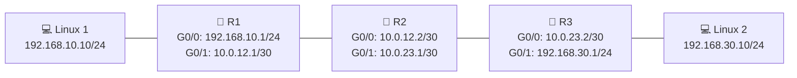
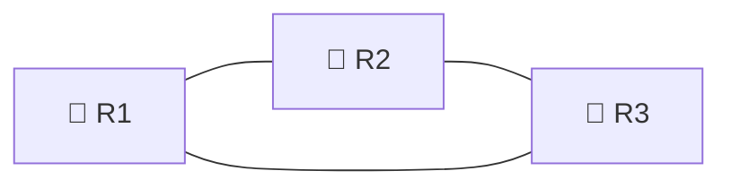

# Laboratório 04 - RIP e análise de convergência

**Disciplina:** Protocolos de Transporte e Roteamento  
**Professor responsável:** **Prof. Dr. Laerte Peotta de Melo**

---

## 1. Tema

Implementação do **RIPv2** em topologia com múltiplos roteadores, seguida de **análise de convergência após falha de enlace**.

---

## 2. Justificativa didática

Este laboratório eleva o nível de dificuldade em relação às práticas iniciais da disciplina ao introduzir um protocolo de roteamento dinâmico clássico baseado em **vetor-distância**. A atividade permite ao aluno observar não apenas a configuração do **RIPv2**, mas também o comportamento da rede diante de uma mudança de topologia.

Ao analisar a propagação de rotas, o desaparecimento de caminhos e o tempo necessário para a rede atingir um novo estado estável, o estudante compreende limitações importantes do RIP, como **convergência lenta**, dependência de temporizadores e vulnerabilidade a problemas como **count to infinity**. A prática também prepara o terreno para comparações futuras com protocolos de convergência mais rápida, como o **OSPF**.

---

## 3. Objetivos

Ao final da atividade, o aluno deverá ser capaz de:

- configurar o **RIPv2** em uma topologia com três roteadores;
- anunciar redes diretamente conectadas;
- verificar tabelas de roteamento e parâmetros do protocolo RIP;
- observar o comportamento da rede após a queda de um enlace;
- medir e interpretar o **tempo de convergência**;
- analisar o impacto de mecanismos como **split horizon**, **poison reverse** e **triggered updates**;
- relacionar a prática com as limitações do RIP em redes maiores.

---

## 4. Fundamentação teórica

O RIP é um protocolo de roteamento do tipo **vetor-distância**, simples de configurar e adequado a redes pequenas. Seu funcionamento baseia-se na troca periódica de informações de rota entre roteadores vizinhos, utilizando a métrica de **número de saltos**.

Entre suas principais limitações estão:

- máximo de **15 hops** como distância válida;
- convergência lenta;
- possibilidade de formação de loops temporários;
- ocorrência do problema de **contagem ao infinito** em mudanças de topologia.

O **RIPv2** melhora alguns aspectos em relação ao RIPv1, como suporte a **CIDR/VLSM** e uso de **multicast** para envio de atualizações. Ainda assim, continua sendo um protocolo com limitações importantes em cenários maiores ou mais dinâmicos.

---

## 5. Topologia proposta



---

## 6. Endereçamento IP

| Dispositivo | Interface | Endereço IP   | Máscara           | Gateway        |
|-------------|-----------|---------------|-------------------|----------------|
| R1          | G0/0      | 192.168.10.1  | 255.255.255.0     | —              |
| R1          | G0/1      | 10.0.12.1     | 255.255.255.252   | —              |
| R2          | G0/0      | 10.0.12.2     | 255.255.255.252   | —              |
| R2          | G0/1      | 10.0.23.1     | 255.255.255.252   | —              |
| R3          | G0/0      | 10.0.23.2     | 255.255.255.252   | —              |
| R3          | G0/1      | 192.168.30.1  | 255.255.255.0     | —              |
| Linux 1     | eth0      | 192.168.10.10 | 255.255.255.0     | 192.168.10.1   |
| Linux 2     | eth0      | 192.168.30.10 | 255.255.255.0     | 192.168.30.1   |

---

## 7. Montagem do cenário no PNetLab

Adicionar ao laboratório:

- **3 roteadores Cisco** com suporte a RIP;
- **2 hosts Linux simples**;
- enlaces ponto a ponto entre os roteadores.

### Conexões da topologia

- conectar o **Linux 1** à interface **G0/0** do **R1**;
- conectar a interface **G0/1** do **R1** à interface **G0/0** do **R2**;
- conectar a interface **G0/1** do **R2** à interface **G0/0** do **R3**;
- conectar o **Linux 2** à interface **G0/1** do **R3**.

### Resultado esperado da montagem

Ao final da montagem, o cenário deverá permitir:

- conectividade entre cada host e seu gateway local;
- troca de rotas dinâmicas entre os roteadores;
- comunicação fim a fim entre as duas LANs;
- observação do comportamento da rede após uma falha de enlace.

---

## 8. Configuração básica dos hosts Linux

### Linux 1

```bash
ip addr add 192.168.10.10/24 dev eth0
ip link set eth0 up
ip route add default via 192.168.10.1
```

### Linux 2

```bash
ip addr add 192.168.30.10/24 dev eth0
ip link set eth0 up
ip route add default via 192.168.30.1
```

---

## 9. Configuração dos roteadores

### R1

```bash
enable
configure terminal
hostname R1
no ip domain-lookup

interface g0/0
 ip address 192.168.10.1 255.255.255.0
 no shutdown
exit

interface g0/1
 ip address 10.0.12.1 255.255.255.252
 no shutdown
exit

router rip
 version 2
 no auto-summary
 network 192.168.10.0
 network 10.0.12.0
end
copy running-config startup-config
```

### R2

```bash
enable
configure terminal
hostname R2
no ip domain-lookup

interface g0/0
 ip address 10.0.12.2 255.255.255.252
 no shutdown
exit

interface g0/1
 ip address 10.0.23.1 255.255.255.252
 no shutdown
exit

router rip
 version 2
 no auto-summary
 network 10.0.12.0
 network 10.0.23.0
end
copy running-config startup-config
```

### R3

```bash
enable
configure terminal
hostname R3
no ip domain-lookup

interface g0/0
 ip address 10.0.23.2 255.255.255.252
 no shutdown
exit

interface g0/1
 ip address 192.168.30.1 255.255.255.0
 no shutdown
exit

router rip
 version 2
 no auto-summary
 network 10.0.23.0
 network 192.168.30.0
end
copy running-config startup-config
```

---

## 10. Verificação inicial

Em cada roteador, executar:

```bash
show ip interface brief
show ip route
show ip protocols
```

No **Linux 1**, testar a comunicação fim a fim:

```bash
ping 192.168.30.10
```

---

## 11. Experimento de convergência

### Etapa 1 — Estado estável

Com a rede funcionando:

- verificar a rota para `192.168.30.0/24` em **R1**;
- verificar a rota para `192.168.10.0/24` em **R3**;
- confirmar a conectividade entre **Linux 1** e **Linux 2**.

### Etapa 2 — Falha de enlace

Desativar a interface entre **R2** e **R3**.

No **R2**:

```bash
configure terminal
interface g0/1
shutdown
end
```

### Etapa 3 — Observação

Após a falha:

- repetir `show ip route` em **R1**, **R2** e **R3**;
- testar `ping 192.168.30.10` a partir do **Linux 1**;
- registrar em quanto tempo a rota deixa de ser utilizável;
- observar quando a rede atinge novo estado estável.

---

## 12. Comandos de observação sugeridos

```bash
show ip route rip
show ip protocols
debug ip rip
```

> O comando `debug ip rip` deve ser usado com cautela, pois gera saída contínua no console do roteador.

---

## 13. Checklist de validação

- [ ] Topologia criada corretamente no PNetLab  
- [ ] Interfaces dos roteadores configuradas com os endereços corretos  
- [ ] Hosts Linux configurados com IP e gateway corretos  
- [ ] RIPv2 habilitado nos três roteadores  
- [ ] Comando `no auto-summary` aplicado  
- [ ] Rotas RIP visíveis nas tabelas de roteamento  
- [ ] Comunicação fim a fim funcionando antes da falha  
- [ ] Falha de enlace simulada corretamente entre R2 e R3  
- [ ] Alterações na tabela de rotas observadas após a falha  
- [ ] Tempo de convergência registrado  
- [ ] Configurações salvas com sucesso  

---

## 14. Questões para análise

1. Qual foi o tempo aproximado de convergência após a falha do enlace?
2. Quais rotas deixaram de aparecer na tabela de roteamento após a interrupção?
3. O que aconteceu com o tráfego entre as redes `192.168.10.0/24` e `192.168.30.0/24` após a falha?
4. Como o RIP representa uma rota inalcançável?
5. Por que o RIP tende a convergir mais lentamente do que protocolos como o OSPF?
6. Qual a importância dos mecanismos de **split horizon**, **poison reverse** e **triggered updates**?
7. Em que tipo de cenário real o RIP deixaria de ser uma escolha adequada?

---

## 15. Desafio extra

Para elevar ainda mais a dificuldade, monte uma versão alternativa com **topologia redundante**:



Depois:

- anunciar as mesmas LANs;
- derrubar um enlace;
- comparar o comportamento do RIP com e sem caminho alternativo;
- verificar se a rede encontra nova rota e quanto tempo leva.

---

## 16. Entrega

O aluno deverá entregar:

- captura de tela da topologia montada no PNetLab;
- configurações de **R1**, **R2** e **R3**;
- saídas de `show ip route` antes e depois da falha;
- evidência do `ping` antes e depois da falha;
- breve análise do tempo de convergência observado.

---

## 17. Conclusão

Este laboratório amplia a complexidade das práticas anteriores ao introduzir um protocolo de roteamento dinâmico e a análise do comportamento da rede diante de falhas. A configuração do **RIPv2** em uma topologia com múltiplos roteadores permite ao aluno compreender como rotas são propagadas, aprendidas e removidas.

A observação do processo de convergência evidencia limitações clássicas do RIP, especialmente em relação ao tempo de adaptação a mudanças de topologia. Com isso, a atividade estabelece uma base importante para o estudo comparativo com protocolos mais modernos e eficientes, como o **OSPF**, que serão explorados em etapas posteriores da disciplina.

