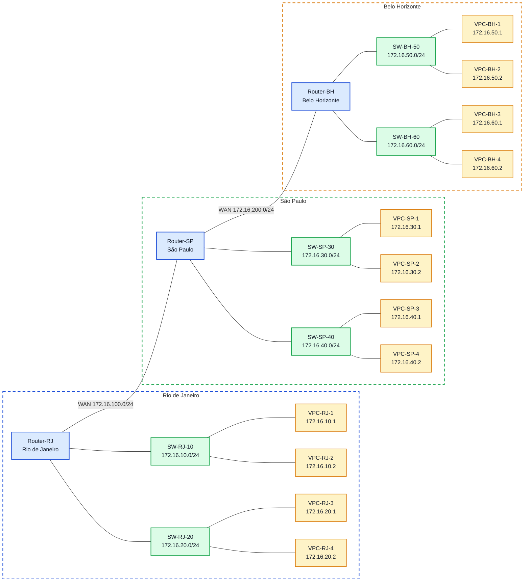

# Laboratório 05 - Roteamento Dinâmico com RIP e OSPF

**Disciplina:** ENE0025 - Protocolos de Transporte e Roteamento  
**Professor responsável:** Prof. Dr. Laerte Peotta de Melo  
**Monitores:** Victor Lima dos Santos / Beatriz Silva Nascimento

---
<h2>Podcast desta Aula</h2>

<table>
  <tr>
    <td width="320" align="center">
      <a href="https://spotifycreators-web.app.link/e/Cc0Kpdi0u2b">
        
      </a>
    </td>
    <td valign="top">
      <p>
        O podcast <strong>Latência Zero</strong> apresenta discussões relacionadas a temas
        abordados em aula, com ênfase em <strong>redes de computadores</strong>,
        <strong>latência</strong>, <strong>infraestrutura de comunicação</strong> e
        aspectos práticos da engenharia de redes.
      </p>
      <p>
        <a href="https://spotifycreators-web.app.link/e/Cc0Kpdi0u2b">Episódio 4: RIP versus OSPF na prática</a>
      </p>
    </td>
  </tr>
</table>


## 1. Objetivo

Configurar e validar o roteamento dinâmico em uma topologia com três roteadores, comparando o funcionamento dos protocolos **RIP** e **OSPF** em um mesmo cenário.

---

## 2. Objetivos específicos

Ao final deste laboratório, o estudante deverá ser capaz de:

- configurar interfaces IP em roteadores Cisco;
- ativar roteamento dinâmico com RIP;
- ativar roteamento dinâmico com OSPF;
- verificar tabelas de roteamento;
- validar conectividade entre redes remotas;
- comparar as características básicas de RIP e OSPF.

---

## 3. Fundamentação teórica 

O roteador precisa saber por onde encaminhar os pacotes para que eles cheguem ao destino correto. Para isso, ele mantém uma tabela de rotas, que funciona como um mapa interno da rede. Essas informações podem ser inseridas de duas formas: manualmente pelo administrador, no caso do roteamento estático, ou aprendidas automaticamente, por meio dos protocolos de roteamento dinâmico. No roteamento dinâmico, os roteadores trocam informações entre si para descobrir quais redes existem e qual é o melhor caminho até elas. Isso torna a rede mais flexível, porque as rotas podem ser atualizadas automaticamente quando ocorre alguma mudança, como a queda de um enlace ou a entrada de uma nova rede.

Os protocolos de roteamento dinâmico podem ser divididos em dois grandes grupos. O primeiro é o dos protocolos internos, chamados de IGP (Interior Gateway Protocol), usados dentro de uma mesma organização, como uma empresa, universidade ou órgão público. O segundo é o dos protocolos externos, chamados de EGP (Exterior Gateway Protocol), usados na comunicação entre redes diferentes na Internet.

O RIP e o OSPF são dois protocolos de roteamento dinâmico do tipo IGP usados para permitir que os roteadores descubram automaticamente os melhores caminhos dentro de uma rede IP. Embora tenham a mesma finalidade, eles funcionam de formas diferentes e, por isso, se adaptam melhor a tipos distintos de cenário.

O RIP é um protocolo do tipo distance-vector, baseado no algoritmo Bellman-Ford. Ele escolhe as rotas a partir da contagem de saltos, ou seja, considera quantos roteadores o pacote precisa atravessar até chegar ao destino. Quanto menor esse número, melhor a rota. Como o RIP aceita no máximo 15 saltos, ele é mais indicado para redes menores, mais simples e com pouca complexidade. O OSPF, por sua vez, é um protocolo do tipo link-state. Ele funciona de maneira mais avançada, pois cada roteador constrói uma visão lógica da topologia da rede e calcula o melhor caminho usando o algoritmo SPF/Dijkstra. Com isso, o OSPF oferece maior escalabilidade, convergência mais eficiente e uma organização lógica melhor da rede, sendo mais adequado para ambientes maiores e mais exigentes.

O RIP funciona como pedir informação para alguém e receber a resposta assim:
“Vá pelo caminho com menos cruzamentos.”
Ele não analisa se a avenida é mais rápida, se há trânsito, se a estrada é melhor ou se existe um caminho mais eficiente. Ele só conta quantas “etapas” existem até o destino. É uma forma simples de decidir, e por isso funciona bem em trajetos curtos e pouco complexos.

Já o OSPF se parece mais com usar um aplicativo de navegação, como um GPS mais inteligente.
Ele não olha apenas quantas ruas existem no caminho. Ele considera a qualidade das vias, a capacidade delas e qual rota tende a ser melhor. Além disso, ele monta um “mapa” mais completo da região antes de escolher o trajeto. Por isso, consegue tomar decisões melhores em cenários maiores e mais complexos.


---

## 4. Topologia do laboratório

A topologia possui três roteadores interligando três unidades:

- **Router-RJ** - Rio de Janeiro
- **Router-SP** - São Paulo
- **Router-BH** - Belo Horizonte

Cada unidade possui duas LANs locais, e os roteadores são interligados por duas redes WAN.



---

## 5. Plano de endereçamento

## Tipos de interfaces

- **`f` = FastEthernet**  
  Interface Ethernet de menor velocidade, muito comum em laboratórios e em equipamentos mais antigos.  
  **Exemplo de uso:** conexão do roteador a uma rede local ou a um switch.  
  **Exemplo de interface:** `f0/0`, `f0/1`

- **`g` = GigabitEthernet**  
  Interface Ethernet de maior velocidade, bastante usada em redes atuais.  
  **Exemplo de uso:** uplink entre switches, conexão do roteador com a LAN principal ou com outro equipamento de maior capacidade.  
  **Exemplo de interface:** `g0/0`, `g0/1`

- **`s` = Serial**  
  Interface serial, muito utilizada em cenários WAN e em laboratórios de roteamento entre roteadores.  
  **Exemplo de uso:** enlace entre duas filiais ou conexão ponto a ponto entre roteadores.  
  **Exemplo de interface:** `s0/0`, `s0/1`

- **`lo` = Loopback**  
  Interface lógica, não física, criada por software.  
  **Exemplo de uso:** testes de conectividade, identificação estável do roteador e uso em protocolos de roteamento.  
  **Exemplo de interface:** `lo0`

- **`vlan` = interface lógica de VLAN**  
  Interface virtual associada a uma VLAN, muito comum em switches camada 3.  
  **Exemplo de uso:** gerenciamento do switch ou roteamento entre VLANs.  
  **Exemplo de interface:** `interface vlan 10`

- **`tunnel` = interface virtual de túnel**  
  Interface lógica usada para encapsular tráfego e criar comunicação virtual entre dois pontos.  
  **Exemplo de uso:** VPN, GRE ou transporte de IPv6 sobre IPv4.  
  **Exemplo de interface:** `tunnel0`


O cenário segue uma lógica simples com redes da faixa `172.16.0.0/16`, organizadas em sub-redes `/24`.


### 5.1 Redes utilizadas

| Segmento | Rede | Máscara |
|---|---|---|
| LAN RJ-10 | 172.16.10.0 | 255.255.255.0 |
| LAN RJ-20 | 172.16.20.0 | 255.255.255.0 |
| WAN RJ-SP | 172.16.100.0 | 255.255.255.0 |
| LAN SP-30 | 172.16.30.0 | 255.255.255.0 |
| LAN SP-40 | 172.16.40.0 | 255.255.255.0 |
| WAN SP-BH | 172.16.200.0 | 255.255.255.0 |
| LAN BH-50 | 172.16.50.0 | 255.255.255.0 |
| LAN BH-60 | 172.16.60.0 | 255.255.255.0 |

### 5.2 Endereçamento das interfaces dos roteadores

#### Router-RJ

| Interface | Endereço IP | Máscara | Função |
|---|---|---|---|
| `s0/0` | 172.16.100.1 | 255.255.255.0 | WAN para São Paulo |
| `f0/0` | 172.16.10.254 | 255.255.255.0 | LAN RJ-10 |
| `f0/1` | 172.16.20.254 | 255.255.255.0 | LAN RJ-20 |

#### Router-SP

| Interface | Endereço IP | Máscara | Função |
|---|---|---|---|
| `s0/0` | 172.16.100.2 | 255.255.255.0 | WAN para Rio de Janeiro |
| `f0/0` | 172.16.30.254 | 255.255.255.0 | LAN SP-30 |
| `f0/1` | 172.16.40.254 | 255.255.255.0 | LAN SP-40 |
| `s0/1` | 172.16.200.1 | 255.255.255.0 | WAN para Belo Horizonte |

#### Router-BH

| Interface | Endereço IP | Máscara | Função |
|---|---|---|---|
| `s0/0` | 172.16.200.2 | 255.255.255.0 | WAN para São Paulo |
| `f0/0` | 172.16.50.254 | 255.255.255.0 | LAN BH-50 |
| `f0/1` | 172.16.60.254 | 255.255.255.0 | LAN BH-60 |

### 5.3 Endereçamento dos hosts

| Host | Endereço IP | Máscara | Gateway |
|---|---|---|---|
| VPC-RJ-10-1 | 172.16.10.1 | 255.255.255.0 | 172.16.10.254 |
| VPC-RJ-10-2 | 172.16.10.2 | 255.255.255.0 | 172.16.10.254 |
| VPC-RJ-20-1 | 172.16.20.1 | 255.255.255.0 | 172.16.20.254 |
| VPC-RJ-20-2 | 172.16.20.2 | 255.255.255.0 | 172.16.20.254 |
| VPC-SP-30-1 | 172.16.30.1 | 255.255.255.0 | 172.16.30.254 |
| VPC-SP-30-2 | 172.16.30.2 | 255.255.255.0 | 172.16.30.254 |
| VPC-SP-40-1 | 172.16.40.1 | 255.255.255.0 | 172.16.40.254 |
| VPC-SP-40-2 | 172.16.40.2 | 255.255.255.0 | 172.16.40.254 |
| VPC-BH-50-1 | 172.16.50.1 | 255.255.255.0 | 172.16.50.254 |
| VPC-BH-50-2 | 172.16.50.2 | 255.255.255.0 | 172.16.50.254 |
| VPC-BH-60-1 | 172.16.60.1 | 255.255.255.0 | 172.16.60.254 |
| VPC-BH-60-2 | 172.16.60.2 | 255.255.255.0 | 172.16.60.254 |

---

## 6. Montagem no PNetLab

Montar a topologia com:

- 3 roteadores Cisco;
- 6 switches;
- 12 PCs;
- 2 enlaces WAN entre os roteadores;
- enlaces Ethernet entre roteadores, switches e hosts.

---

## 7. Configuração básica das interfaces

> Obs.: antes de configurar as interfaces dos roteadores, é interessante configurar os endereços das máquinas que representam as sub-redes, com seus respectivos gateways. É importante lembrar que o gateway de cada sub-rede será a interface do roteador que foi configurada como membro dessa mesma sub-rede.

### Configuração para PC-BH-60-2 (Exemplo)

```bash
O formato básico é ip <ip_address> <subnet_mask> <gateway>

ip 172.16.60.2 255.255.255.0 172.16.60.254
show ip
save

```


Repita o mesmo comando para todos os outros VPCs considerando a seção **5.3 Endereçamento dos hosts**
 

### 7.1 Router-RJ

```bash
Router> enable
Router# configure terminal
Router(config)# hostname Router-RJ
Router-RJ(config)# interface s0/0
Router-RJ(config-if)# ip address 172.16.100.1 255.255.255.0
Router-RJ(config-if)# no shut
Router-RJ(config-if)# interface f0/0
Router-RJ(config-if)# ip address 172.16.10.254 255.255.255.0
Router-RJ(config-if)# no shut
Router-RJ(config-if)# interface f0/1
Router-RJ(config-if)# ip address 172.16.20.254 255.255.255.0
Router-RJ(config-if)# no shut
Router-RJ(config-if)# end

```

### 7.2 Router-SP

```bash
Router> enable
Router# configure terminal
Router(config)# hostname Router-SP
Router-SP(config)# interface s0/0
Router-SP(config-if)# ip address 172.16.100.2 255.255.255.0
Router-SP(config-if)# clock rate 500000
Router-SP(config-if)# no shut
Router-SP(config-if)# interface s0/1
Router-SP(config-if)# ip address 172.16.200.1 255.255.255.0
Router-SP(config-if)# clock rate 500000
Router-SP(config-if)# no shut
Router-SP(config-if)# interface f0/0
Router-SP(config-if)# ip address 172.16.30.254 255.255.255.0
Router-SP(config-if)# no shut
Router-SP(config-if)# interface f0/1
Router-SP(config-if)# ip address 172.16.40.254 255.255.255.0
Router-SP(config-if)# no shut
Router-SP(config-if)# end

```

### 7.3 Router-BH

```bash
Router> enable
Router# configure terminal
Router(config)# hostname Router-BH
Router-BH(config)# interface s0/0
Router-BH(config-if)# ip address 172.16.200.2 255.255.255.0
Router-BH(config-if)# no shut
Router-BH(config-if)# interface f0/0
Router-BH(config-if)# ip address 172.16.50.254 255.255.255.0
Router-BH(config-if)# no shut
Router-BH(config-if)# interface f0/1
Router-BH(config-if)# ip address 172.16.60.254 255.255.255.0
Router-BH(config-if)# no shut
Router-BH(config-if)# end

```

---

## 8. Verificação inicial sem roteamento dinâmico

Antes de configurar RIP ou OSPF, verificar:

- conectividade apenas entre redes diretamente conectadas;
- ausência de rotas remotas;
- tabela de rotas contendo apenas rotas conectadas.

### Comando de verificação

```bash
show ip route
```

### Resultado esperado

- presença de rotas `C` e `L`;
- ausência de rotas aprendidas dinamicamente;
- pings bem-sucedidos apenas para redes diretamente conectadas.

---

## 9. Configuração do RIP

Como o cenário usa a faixa `172.16.0.0/16`, pode-se anunciar a rede maior `172.16.0.0` no processo RIP.

### 9.1 Router-RJ

```bash
Router-RJ> enable
Router-RJ# configure terminal
Router-RJ(config)# router rip
Router-RJ(config-router)# network 172.16.0.0
Router-RJ(config-router)# end
Router-RJ#

```

### 9.2 Router-SP

```bash
Router-SP> enable
Router-SP# configure terminal
Router-SP(config)# router rip
Router-SP(config-router)# network 172.16.0.0
Router-SP(config-router)# end
Router-SP#
```

### 9.3 Router-BH

```bash
Router-BH> enable
Router-BH# configure terminal
Router-BH(config)# router rip
Router-BH(config-router)# network 172.16.0.0
Router-BH(config-router)# end
Router-BH#
```

---

## 10. Verificação do RIP

### Comandos

```bash
show ip route
show ip protocols
ping 172.16.30.1
ping 172.16.40.1
ping 172.16.50.1
ping 172.16.60.1
```

### Resultado esperado

- rotas aprendidas com marcação `R`;
- comunicação fim a fim entre as redes;
- percepção de que o RIP usa contagem de saltos como métrica.

---

## 11. Remoção do RIP

Em cada roteador:

```bash
configure terminal
no router rip
end
write memory
```

---

## 12. Configuração do OSPF

Neste laboratório será utilizada apenas a **área 0**, com objetivo introdutório.

### 12.1 Router-RJ

```bash
Router-RJ> enable
Router-RJ# configure terminal
Router-RJ(config)# router ospf 64
Router-RJ(config-router)# network 172.16.10.0 0.0.0.255 area 0
Router-RJ(config-router)# network 172.16.20.0 0.0.0.255 area 0
Router-RJ(config-router)# network 172.16.100.0 0.0.0.255 area 0
Router-RJ(config-router)# end
```

### 12.2 Router-SP

```bash
Router-SP> enable
Router-SP# configure terminal
Router-SP(config)# router ospf 65
Router-SP(config-router)# network 172.16.30.0 0.0.0.255 area 0
Router-SP(config-router)# network 172.16.40.0 0.0.0.255 area 0
Router-SP(config-router)# network 172.16.100.0 0.0.0.255 area 0
Router-SP(config-router)# network 172.16.200.0 0.0.0.255 area 0
Router-SP(config-router)# end
```

### 12.3 Router-BH

```bash
Router-BH> enable
Router-BH# configure terminal
Router-BH(config)# router ospf 66
Router-BH(config-router)# network 172.16.50.0 0.0.0.255 area 0
Router-BH(config-router)# network 172.16.60.0 0.0.0.255 area 0
Router-BH(config-router)# network 172.16.200.0 0.0.0.255 area 0
Router-BH(config-router)# end

```

---

## 13. Verificação do OSPF

### Comandos em todos os roteadores

```bash
show ip ospf neighbor
show ip route
show ip protocols
ping 172.16.30.1
ping 172.16.40.1
ping 172.16.50.1
ping 172.16.60.1
```

### Resultado esperado

- adjacência OSPF formada entre RJ-SP e SP-BH;
- rotas aprendidas com marcação `O`;
- conectividade total entre todas as LANs.

---

## 14. Testes sugeridos

### 14.1 Teste de alcance entre unidades

A partir de um host do Rio de Janeiro, testar conectividade com São Paulo e Belo Horizonte.

Exemplo a partir do PC-RJ-10-1:

```bash
ping 172.16.30.1
ping 172.16.40.1
ping 172.16.50.1
ping 172.16.60.1
```

### 14.2 Teste de tabela de rotas

```bash
show ip route
```

### 14.3 Teste de vizinhança OSPF

```bash
show ip ospf neighbor
```

---

## 15. Comparação orientada entre RIP e OSPF

Após concluir as duas configurações, responder:

1. Qual protocolo foi mais simples de configurar?
2. Qual protocolo apresentou maior riqueza de informações operacionais?
3. Qual a principal métrica do RIP?
4. Qual algoritmo é usado pelo OSPF?
5. Qual protocolo tende a escalar melhor?
6. Qual protocolo converge melhor em cenários maiores?

---

## 16. Troubleshooting proposto

### Situação 1 – Remover uma rede do anúncio OSPF em São Paulo

```bash
configure terminal
router ospf 1
 no network 172.16.40.0 0.0.0.255 area 0
end
```

Verificar:

- perda de rota para a rede `172.16.40.0/24`;
- impacto na conectividade;
- necessidade de restaurar a configuração.

### Situação 2 – Interromper o enlace SP-BH

```bash
configure terminal
interface s0/1
 shutdown
end
```

Verificar:

- perda da adjacência com BH;
- remoção de rotas remotas;
- impacto nos testes de ping.

Restaurar:

```bash
configure terminal
interface s0/1
 no shutdown
end
```

### Situação 3 – Remover o RIP de um roteador

```bash
configure terminal
no router rip
end
```

Verificar o impacto na propagação de rotas.

---

## 17. Critérios de avaliação

| Critério | Pontos |
|---|---:|
| Configuração correta das interfaces | 2,0 |
| Funcionamento do RIP | 2,0 |
| Funcionamento do OSPF | 2,0 |
| Testes de conectividade | 2,0 |
| Análise comparativa RIP x OSPF | 2,0 |

**Total: 10,0**

---

## 18. Entregáveis

- print da topologia no PNetLab;
- print do `show ip route` com RIP;
- print do `show ip route` com OSPF;
- print do `show ip ospf neighbor`;
- breve relatório contendo:
  - objetivo;
  - topologia;
  - comandos aplicados;
  - testes realizados;
  - comparação entre RIP e OSPF.

---

## 19. Referências

- BRITO, Samuel Henrique Bucke. *Laboratórios de Tecnologias Cisco em Infraestrutura de Redes*. 2. ed. São Paulo: Novatec, 2014.
- LOBATO, Luiz Carlos. *Protocolos de Roteamento IP*. Rio de Janeiro: RNP/ESR, 2013.
- KUROSE, James F.; ROSS, Keith W. *Redes de Computadores e a Internet: uma abordagem top-down*. 8. ed. Porto Alegre: Pearson/Bookman, 2021.
