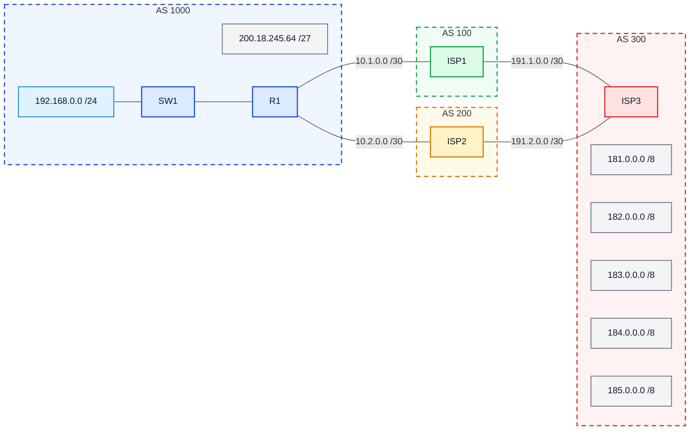

# Laboratório 06 - Roteamento Externo via BGP

**Disciplina:** ENE0025 - Protocolos de Transporte e Roteamento  
**Professor responsável:** Prof. Dr. Laerte Peotta de Melo  
**Monitores:** Victor Lima dos Santos / Beatriz Silva Nascimento

---

## 1. Objetivo

Configurar o protocolo **BGP** no roteador da empresa para que ela possa **anunciar seu prefixo público à Internet** por meio de seus provedores.

---

## 2. Objetivos específicos

Ao final deste laboratório, o estudante deverá ser capaz de:

- compreender o papel do **BGP** no roteamento entre sistemas autônomos;
- identificar vizinhanças **eBGP**;
- configurar o BGP em um roteador de borda corporativo;
- anunciar um prefixo público usando o comando `network`;
- entender o uso de **loopback**, `update-source` e `ebgp-multihop`;
- verificar a tabela de rotas e a tabela BGP.

---

## 3. Fundamentação teórica 

O cenário representa um pequeno trecho do núcleo operacional da Internet, com **três provedores** e **uma empresa** que precisa anunciar o bloco público **`200.18.245.64/27`**.  **BGP** é um protocolo de roteamento **interdomínios**, usado entre **sistemas autônomos (AS)**.

O material informa ainda que:

- a empresa pertence ao **AS 1000**;
- o **ISP1** pertence ao **AS 100**;
- o **ISP2** pertence ao **AS 200**;
- a senha das vizinhanças é **`SENHA`**.

---

## 4. Topologia do laboratório

O Laboratório 06 trabalha com uma empresa conectada a dois provedores, sendo:

- um pareamento com o **ISP1** usando **loopback**;
- um pareamento com o **ISP2** usando o endereço real da interface.

### Diagrama lógico 



---

## 5. Informações fornecidas pelo cenário

- a empresa anuncia o bloco **`200.18.245.64/27`**;
- o vizinho do **ISP1** deve ser estabelecido com a loopback **`10.10.10.10/32`**;
- a empresa deve usar a loopback **`11.11.11.11/32`** como origem da sessão com o ISP1;
- a vizinhança com o **ISP2** será feita pelos endereços reais das interfaces diretamente conectadas.

---

## 6. Configuração básica das interfaces em R1


```bash
R1> enable

R1# configure terminal

R1(config)# no ip domain lookup

R1(config)# interface loopback 1

R1(config-if)# ip address 11.11.11.11 255.255.255.255

R1(config-if)# no shut

R1(config-if)# interface f0/0

R1(config-if)# ip address 192.168.0.1 255.255.255.0

R1(config-if)# no shut

R1(config-if)# interface serial 2/0

R1(config-if)# ip address 10.1.0.1 255.255.255.252

R1(config-if)# no shut

R1(config-if)# interface serial 2/1

R1(config-if)# ip address 10.1.0.5 255.255.255.252

R1(config-if)# no shut

R1(config-if)# interface serial 2/2

R1(config-if)# ip address 10.2.0.1 255.255.255.252

R1(config-if)# no shut

R1(config-if)# end
```

---

## 7. Configuração do BGP em R1


```bash
R1> enable

R1# configure terminal

R1(config)# router bgp 1000

R1(config-router)# neighbor 10.10.10.10 remote-as 100

R1(config-router)# neighbor 10.10.10.10 password SENHA

R1(config-router)# neighbor 10.10.10.10 ebgp-multihop 2

R1(config-router)# neighbor 10.10.10.10 update-source Loopback1

R1(config-router)# neighbor 10.2.0.2 remote-as 200

R1(config-router)# neighbor 10.2.0.2 password SENHA

R1(config-router)# network 200.18.245.64 mask 255.255.255.224

R1(config-router)# exit

R1(config)# ip route 10.10.10.10 255.255.255.255 Serial2/0

R1(config)# ip route 10.10.10.10 255.255.255.255 Serial2/1

R1(config)# ip route 200.18.245.64 255.255.255.224 Null0
```

---

## 8. Explicação da configuração


- primeiro o BGP foi inicializado no **AS 1000**;
- depois foi configurada a vizinhança com o **ISP1** usando **endereços de loopback**;
- por isso foi necessário usar:
  - `update-source Loopback1`
  - `ebgp-multihop 2`
  - duas rotas estáticas para alcançar `10.10.10.10/32`;
- em seguida foi configurada a vizinhança com o **ISP2**, desta vez usando o endereço real da interface;
- por fim, foi anunciado o prefixo público da empresa com:
  - `network 200.18.245.64 mask 255.255.255.224`

---

## 9. Verificação

Verificar os seguintes comandos em todos os roteadores dos ASs.

```bash
Router# show ip route

Router# show ip bgp

Router# show ip bgp summary

Router# show run
```

---

## 10. O que o aluno deve observar

Durante a verificação, o aluno deve observar:

- se as vizinhanças BGP foram estabelecidas;
- se o prefixo **`200.18.245.64/27`** aparece sendo anunciado;
- se a tabela BGP mostra rotas aprendidas dos provedores;
- se a tabela de rotas contém a rota estática para `10.10.10.10/32`;
- se a rota para `200.18.245.64/27` foi criada com `Null0` para permitir o anúncio do prefixo sumarizado.

---

## 11. Questões para análise

1. Qual é a função do BGP nesse cenário?
2. Por que a sessão com o ISP1 usa endereço de loopback?
3. Por que foi necessário configurar `ebgp-multihop 2`?
4. Qual a função do `update-source Loopback1`?
5. Por que foi criada a rota `ip route 200.18.245.64 255.255.255.224 Null0`?
6. Qual a diferença entre o pareamento com o ISP1 e com o ISP2?

---

## 12. Critérios de avaliação

| Critério | Pontos |
|---|---:|
| Configuração correta das interfaces | 2,0 |
| Configuração correta do BGP | 3,0 |
| Entendimento da vizinhança por loopback | 2,0 |
| Verificação com comandos de análise | 1,5 |
| Respostas técnicas das questões | 1,5 |

**Total: 10,0**

---

## 13. Entregáveis

Cada grupo deve entregar:

- print da topologia no emulador;
- print do `show ip bgp summary`;
- print do `show ip bgp`;
- print do `show ip route`;
- relatório curto com:
  - objetivo;
  - comandos executados;
  - explicação da sessão com loopback;
  - conclusão.

---

