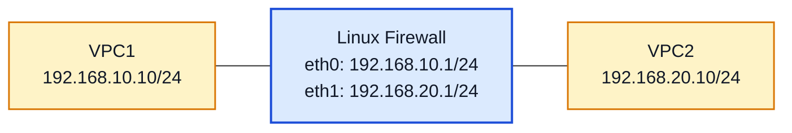

# Lab 10A – Firewall de Pacotes com `iptables`

**Disciplina:** Protocolos de Transporte e Roteamento  
**Curso:** Engenharia de Redes de Comunicação  
**Professor:** Prof. Dr. Laerte Peotta de Melo  
**Ambiente:** PNetLab  
**Nível:** Intermediário

---

## Objetivo

Implementar um **firewall de pacotes** em uma máquina Linux no PNetLab, posicionada entre duas VPCs, aplicando regras com `iptables` para controlar o tráfego entre duas redes distintas com base em endereço IP, protocolo e porta.

---
## Introdução

Um **firewall de pacotes** é um mecanismo de segurança que analisa os pacotes de rede individualmente e decide se eles podem ou não atravessar um determinado ponto da rede. Essa decisão é tomada com base em informações presentes no cabeçalho do pacote, como **endereço IP de origem**, **endereço IP de destino**, **protocolo** e **porta de comunicação**. Em outras palavras, ele funciona como um filtro que verifica regras previamente definidas e permite ou bloqueia o tráfego conforme essas regras.

No Linux, uma das ferramentas clássicas para implementar esse tipo de controle é o **iptables**. Com ele, é possível criar regras para autorizar ou negar comunicações específicas entre redes, hosts e serviços. Em um laboratório, isso permite demonstrar de forma prática como uma máquina Linux pode atuar como firewall entre dois segmentos de rede, controlando o fluxo de pacotes de maneira simples e objetiva.

Diferentemente de um firewall stateful, que acompanha o estado das conexões, o firewall de pacotes analisa cada pacote de forma isolada. Por isso, o administrador precisa definir explicitamente o que será permitido e o que será bloqueado em cada direção do tráfego.

## Principais comandos do `iptables`

| Comando | Função principal | Exemplo | Explicação |
|---|---|---|---|
| `iptables -L -n -v` | Listar regras | `sudo iptables -L -n -v` | Mostra as regras ativas, a política padrão de cada cadeia e os contadores de pacotes e bytes. |
| `iptables -S` | Exibir regras em formato textual | `sudo iptables -S` | Mostra as regras em uma forma parecida com a sintaxe usada para criá-las. |
| `iptables -A` | Adicionar regra ao final | `sudo iptables -A FORWARD -p icmp -j ACCEPT` | Acrescenta uma nova regra ao final da cadeia escolhida. |
| `iptables -I` | Inserir regra em posição específica | `sudo iptables -I FORWARD 1 -p tcp --dport 23 -j DROP` | Insere a regra em uma posição definida, útil quando a ordem das regras importa. |
| `iptables -D` | Apagar regra | `sudo iptables -D FORWARD 3` | Remove uma regra da cadeia, normalmente pelo número da linha ou repetindo a sintaxe completa. |
| `iptables -P` | Definir política padrão | `sudo iptables -P FORWARD DROP` | Define o comportamento padrão da cadeia quando nenhum pacote corresponder às regras existentes. |
| `iptables -F` | Limpar regras | `sudo iptables -F` | Remove todas as regras das cadeias padrão. |
| `iptables -X` | Remover cadeias personalizadas | `sudo iptables -X` | Apaga cadeias criadas manualmente pelo administrador. |
| `iptables -Z` | Zerar contadores | `sudo iptables -Z` | Reinicia os contadores de pacotes e bytes das regras. |
| `iptables -N` | Criar cadeia personalizada | `sudo iptables -N BLOQUEIOS` | Cria uma nova cadeia para organizar melhor as regras. |
| `-j ACCEPT` | Permitir tráfego | `sudo iptables -A FORWARD -p tcp --dport 80 -j ACCEPT` | Define que o pacote correspondente à regra será aceito. |
| `-j DROP` | Bloquear tráfego | `sudo iptables -A FORWARD -p tcp --dport 23 -j DROP` | Define que o pacote correspondente à regra será descartado. |
| `--dport` | Filtrar porta de destino | `sudo iptables -A FORWARD -p tcp --dport 80 -j ACCEPT` | Permite criar regras com base na porta de destino. |
| `--sport` | Filtrar porta de origem | `sudo iptables -A FORWARD -p tcp --sport 80 -j ACCEPT` | Permite criar regras com base na porta de origem. |
| `-s` | Definir IP de origem | `sudo iptables -A FORWARD -s 192.168.10.10 -j ACCEPT` | Filtra pacotes pelo endereço de origem. |
| `-d` | Definir IP de destino | `sudo iptables -A FORWARD -d 192.168.20.10 -j ACCEPT` | Filtra pacotes pelo endereço de destino. |
| `-p` | Definir protocolo | `sudo iptables -A FORWARD -p icmp -j ACCEPT` | Permite aplicar a regra apenas a um protocolo, como `icmp`, `tcp` ou `udp`. |


## Síntese

De forma resumida, o `iptables` permite transformar uma máquina Linux em um **firewall de pacotes**, no qual cada regra determina quais pacotes podem passar e quais devem ser bloqueados. Isso torna o laboratório bastante útil para mostrar, na prática, como o controle de tráfego pode ser feito em redes reais.


## Observação inicial

> **Importante:** neste laboratório, a máquina Linux atuará como **roteador e firewall** entre duas redes.
>
> O foco desta prática é o **firewall de pacotes**, portanto as regras serão baseadas em:
>
> - endereço IP de origem;
> - endereço IP de destino;
> - protocolo;
> - porta.
>
> Neste primeiro momento, **não será usada inspeção stateful**.  
> A comparação com firewall stateful poderá ser feita em um laboratório posterior.

---

## Situação-problema

Uma organização deseja controlar o tráfego entre uma rede interna e uma rede externa utilizando uma máquina Linux como firewall. O objetivo é permitir apenas alguns tipos de comunicação entre os segmentos, bloqueando acessos indevidos e analisando o comportamento do tráfego quando as regras são aplicadas no roteamento entre as redes.

---

## Topologia lógica



---

## Plano de endereçamento

| Dispositivo | Interface | Endereço IP | Máscara | Gateway |
|---|---|---|---|---|
| VPC1 | eth0 | 192.168.10.10 | 255.255.255.0 | 192.168.10.1 |
| Linux Firewall | eth0 | 192.168.10.1 | 255.255.255.0 | — |
| Linux Firewall | eth1 | 192.168.20.1 | 255.255.255.0 | — |
| VPC2 | eth0 | 192.168.20.10 | 255.255.255.0 | 192.168.20.1 |

---

## Premissas do laboratório

Considere que:

- a topologia já foi montada no PNetLab;
- a máquina Linux possui duas interfaces de rede;
- as VPCs já estão ligadas aos segmentos corretos;
- o sistema Linux possui `iptables` disponível.

Neste laboratório, o foco será:

- configurar IP nas interfaces;
- ativar o roteamento IP no Linux;
- criar regras de firewall com `iptables`;
- testar conectividade e bloqueios.

---

## Configuração das VPCs

### VPC1

```bash
ip 192.168.10.10/24 192.168.10.1
save
```

### VPC2

```bash
ip 192.168.20.10/24 192.168.20.1
save
```

---

## Configuração básica da máquina Linux

Configure os endereços IP das interfaces da máquina Linux.

```bash
sudo ip addr add 192.168.10.1/24 dev eth0
sudo ip addr add 192.168.20.1/24 dev eth1
sudo ip link set eth0 up
sudo ip link set eth1 up
```

Verifique a configuração:

```bash
ip addr show
```

---

## Ativação do roteamento IP

Para que a máquina Linux encaminhe pacotes entre as duas redes, é necessário ativar o roteamento IPv4.

```bash
sudo sysctl -w net.ipv4.ip_forward=1
```

Para confirmar:

```bash
cat /proc/sys/net/ipv4/ip_forward
```

O valor esperado é:

```bash
1
```

---

## Teste inicial sem firewall

Antes de aplicar regras, teste a conectividade básica entre as duas VPCs.

### A partir da VPC1

```bash
ping 192.168.20.10
```

### A partir da VPC2

```bash
ping 192.168.10.10
```

Se o roteamento estiver correto, os pings devem funcionar.

---

## Limpeza das regras antigas

Antes de iniciar a configuração do firewall, limpe regras anteriores do `iptables`.

```bash
sudo iptables -F
sudo iptables -X
sudo iptables -Z
```

Defina a política padrão da cadeia `FORWARD` como bloqueio:

```bash
sudo iptables -P FORWARD DROP
```

---

## Primeiras regras do firewall de pacotes

Nesta etapa, será permitido apenas:

- **ICMP** da VPC1 para a VPC2;
- **HTTP** da VPC1 para a VPC2;
- tráfego de retorno correspondente a essas permissões, de forma explícita.

### Permitir ICMP da VPC1 para a VPC2

```bash
sudo iptables -A FORWARD -s 192.168.10.10 -d 192.168.20.10 -p icmp -j ACCEPT
sudo iptables -A FORWARD -s 192.168.20.10 -d 192.168.10.10 -p icmp -j ACCEPT
```

### Permitir HTTP da VPC1 para a VPC2

```bash
sudo iptables -A FORWARD -s 192.168.10.10 -d 192.168.20.10 -p tcp --dport 80 -j ACCEPT
sudo iptables -A FORWARD -s 192.168.20.10 -d 192.168.10.10 -p tcp --sport 80 -j ACCEPT
```

### Bloquear implicitamente o restante

Como a política padrão da cadeia `FORWARD` é `DROP`, qualquer outro tráfego não explicitamente permitido será bloqueado.

---

## Testes práticos

### Teste de ICMP

Na **VPC1**:

```bash
ping 192.168.20.10
```

Resultado esperado: **deve funcionar**.

Na **VPC2**:

```bash
ping 192.168.10.10
```

Resultado esperado: **deve funcionar**, porque o ICMP foi liberado nos dois sentidos.

### Teste de HTTP

Para simular um serviço HTTP na VPC2, use o `nc` ou outro serviço simples em um host Linux, se disponível.  
Se a VPC usada não suportar isso, o teste pode ser feito substituindo a VPC2 por uma VM Linux leve com serviço HTTP.

Exemplo com `nc` em um host Linux:

```bash
nc -l -p 80
```

Na **VPC1**:

```bash
telnet 192.168.20.10 80
```

Resultado esperado: **deve funcionar**.

### Teste de Telnet não permitido

Na **VPC1**:

```bash
telnet 192.168.20.10 23
```

Resultado esperado: **deve falhar**.

### Teste de acesso iniciado pela VPC2

Na **VPC2**, tente iniciar conexão TCP para a VPC1 em uma porta qualquer:

```bash
telnet 192.168.10.10 80
```

Resultado esperado: **deve falhar**, pois não há regra permitindo esse tráfego.

---

## Verificação das regras

### Listar regras com contadores

```bash
sudo iptables -L -n -v
```

### Listar regras da cadeia FORWARD

```bash
sudo iptables -L FORWARD -n -v
```

### Mostrar regras em formato detalhado

```bash
sudo iptables -S
```

### O que observar

- ordem das regras;
- política padrão da cadeia `FORWARD`;
- quantidade de pacotes que corresponderam a cada regra;
- tráfego permitido e bloqueado.

---

## Regra adicional de bloqueio explícito

Para reforçar a visualização didática, adicione uma regra explícita de bloqueio para Telnet:

```bash
sudo iptables -A FORWARD -s 192.168.10.10 -d 192.168.20.10 -p tcp --dport 23 -j DROP
```

> **Observação:** como a política padrão já é `DROP`, essa regra não é obrigatória para o funcionamento, mas ajuda a ilustrar claramente o bloqueio de um serviço específico.

---

## Salvando ou documentando as regras

Dependendo da distribuição Linux, as regras podem ser perdidas após reinicialização.  
Para fins de laboratório, o mais importante é registrar as regras configuradas.

Uma forma simples de documentação é:

```bash
sudo iptables -L -n -v
sudo iptables -S
```

---

## Questões para análise

1. O que caracteriza um **firewall de pacotes**?
2. Quais campos do pacote foram usados nas regras deste laboratório?
3. Por que foi necessário ativar o **IP forwarding** no Linux?
4. Qual é a função da cadeia `FORWARD` no `iptables`?
5. Por que o tráfego não permitido foi bloqueado mesmo sem regras específicas para todos os protocolos?
6. Qual a diferença entre permitir **HTTP** e permitir **ICMP**?
7. O que muda quando a política padrão da cadeia `FORWARD` é `DROP`?
8. Por que esse laboratório ainda não é considerado um firewall stateful?
9. Qual a importância da ordem das regras no `iptables`?
10. Em um ambiente real, quais serviços deveriam ser permitidos entre redes distintas?

---

## Critérios de avaliação

| Critério | Pontos |
|---|---:|
| Configuração correta do endereçamento | 1,5 |
| Ativação correta do roteamento IP | 1,0 |
| Implementação das regras de `iptables` | 3,0 |
| Testes práticos de conectividade e bloqueio | 2,0 |
| Verificação e interpretação das regras | 1,5 |
| Respostas às questões de análise | 1,0 |

**Total: 10,0**

---

## Entregáveis

Cada aluno deve entregar:

- print da topologia no PNetLab;
- print da configuração IP da máquina Linux;
- print do comando `iptables -L -n -v`;
- evidência dos testes de:
  - ping permitido;
  - HTTP permitido;
  - Telnet bloqueado;
- relatório curto contendo:
  - objetivo do laboratório;
  - resumo das regras criadas;
  - análise do que foi permitido e do que foi bloqueado.

---

## Conclusão esperada

Ao final deste laboratório, o estudante deve perceber que:

- uma máquina Linux pode atuar como **firewall de pacotes** entre redes distintas;
- o `iptables` permite controlar o tráfego com base em **IP, protocolo e porta**;
- o roteamento entre redes depende da ativação do **IP forwarding**;
- a política padrão de bloqueio ajuda a tornar o controle mais seguro;
- o firewall de pacotes analisa cada pacote de forma isolada, o que prepara o caminho para a comparação futura com um **firewall stateful**.
