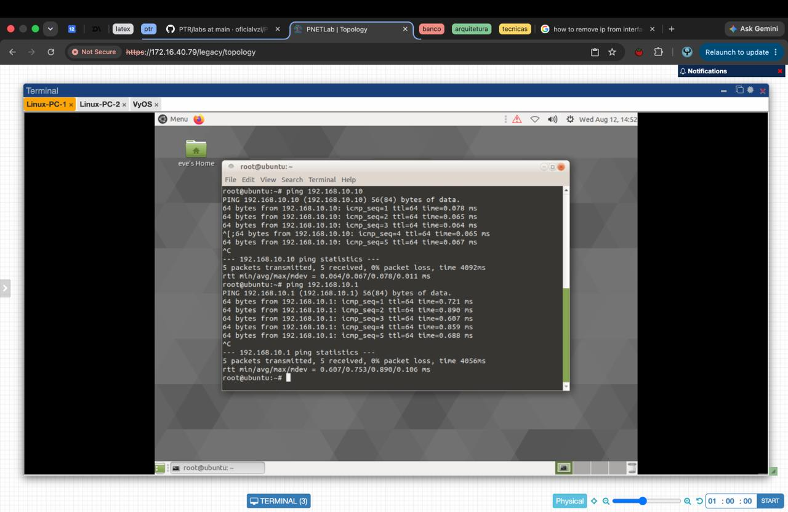
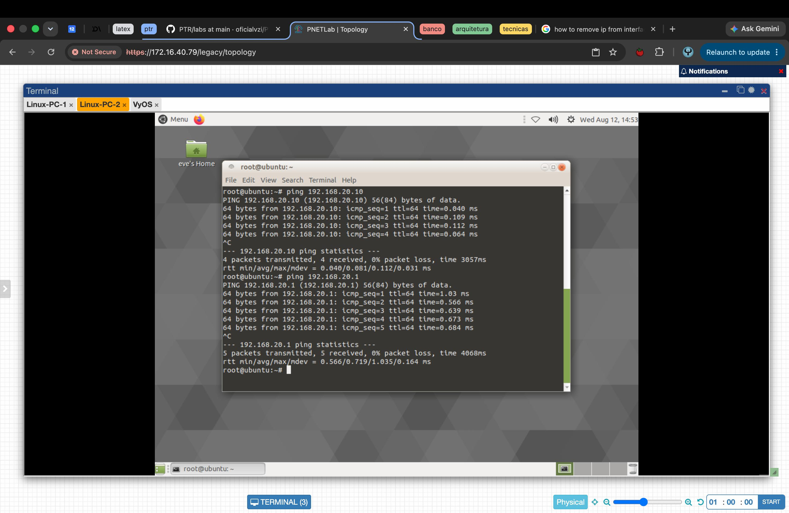
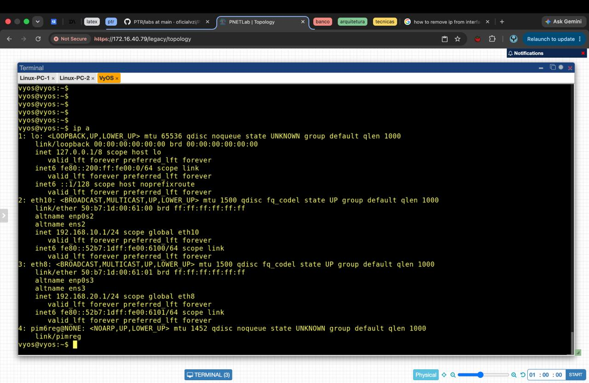
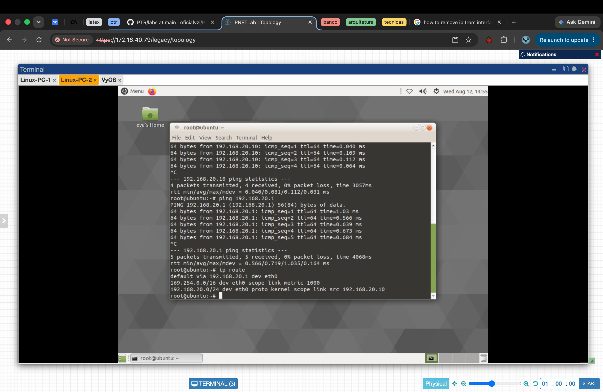

# Relatório 1 - Laboratório 1
**Arthur Choi Braga - 242014300**

## Parte 1 - Setup da topologia

Primeiro foi feito a criação dos dois PCs Linux (PC1 e PC2) e depois o roteador VyOs. Após isso, foi feito a conexão dos dois computadores com o roteador.
## Parte 2 - Configuração de endereçamento IP
Depois de fazer a montagem da topologia a ser utilizada, agora é preciso configurar o endereçamento IP. O endereçamento proposto é o seguinte:
### Endereçamento proposto

| Dispositivo | Interface | IP            | Máscara |
| ----------- | --------- | ------------- | ------- |
| Host A      | eth0      | 192.168.10.10 | /24     |
| Router      | eth0      | 192.168.10.1  | /24     |
| Router      | eth1      | 192.168.20.1  | /24     |
| Host B      | eth0      | 192.168.20.10 | /24     |

Para realizar esse endereçamento foi feito o seguinte:

### 1. Configuração dos hosts
Primeiramente realizei a configuração dos hosts pelos seguintes comandos:

Host A (PC1)

`ip addr add 192.168.10.10/24 dev eth0`

Host B (PC2)

`ip addr add 192.168.20.10/24 dev eth0`

---

### 2. Configuração do roteador
Depois, configurei o roteador:

Roteador (VyOs)

`ip addr add 192.168.10.1/24 dev eth10` 

`ip addr add 192.168.20.1/24 dev eth8`

(O roteador VyOs estava com um erro e criou as interfaces com os nomes eth10 e eth8 em vez de eth0 e eth1 por algum motivo)

---

### 3.  Testes iniciais
Do Host A (PC1):

`ping 192.168.20.10`

*RESULTADO:* Falha, pois o PC1 está tentando conectar com o PC2, sendo que o servidor não tem o gateway padrão conectado, assim não sabendo "pra onde mandar" os pacotes que o PC1 está mandando.

Do Host A (PC1) para o roteador: 

`ping 192.168.10.1`

*RESULTADO:* Sucesso, pois o PC1 está mandando pacotes para o roteador.

#### Pings PC1

#### Pings PC2

---
### Discussão orientada
- O enlace físico funciona?
O enlace físico funciona.
- O IP está configurado corretamente?
Os IPs estão configurados corretamente.
- Por que o pacote não chega ao Host B?
Pois o roteador não tem uma configuração de gateway padrão.

Conclusão: Sem uma decisão de encaminhamento, o pacote não sabe para onde ir.
### 4. Configuração gateway padrão
Agora para fazerem os Hosts conseguirem conversar entre si, precisamos configurar o gateway padrão, e a configuração é feita da seguinte maneira:

**Host A**

`ip route add default via 192.168.10.1`

**Host B**

`ip route add default via 192.168.20.1`

#### Server configurado

### 5. Novo teste 
Agora, realizo o novo teste com o gateway padrão configurado, esperando agora o sucesso na conexão dos dois PCs.

`ping 192.168.20.10`

**Resultado esperado:** sucesso

#### Ping com gateway padrão configurado

### 6. Tabelas iproute
Agora, para finalizar, aqui estão as tabelas 'iproute' de cada PC.

#### iproute PC1

#### iproute PC2

### Discussão orientada

**O roteador conhece o caminho completo?**
Não. Ele só sabe para quais redes tem interface diretamente conectada (192.168.10.0/24 e 192.168.20.0/24) e encaminha pacotes com base nisso; não existe um mapa da rede inteira, só decisões locais.

**Onde ocorreu a "inteligência" da rede?**
Nesse laboratório, eu fiz o papel da inteligência, pois as rotas foram inseridas manualmente (rota padrão nos hosts, endereçamento no roteador). Não houve nenhum protocolo de roteamento dinâmico decidindo nada.

**O que aconteceria com mais roteadores?**
Com uma topologia maior (vários roteadores em série), rotas estáticas feitas à mão não escalariam: seria preciso configurar rota para cada rede remota em cada roteador. Nesse caso seria mais inteligente usar um protocolo de roteamento para que os roteadores trocassem informações entre si e construíssem suas tabelas automaticamente.

**Relação com os conceitos:**

- **Encaminhamento × roteamento:** no roteador VyOS foi feito um *encaminhamento* (forwarding), usar uma tabela já existente para decidir a interface de saída de cada pacote. *Roteamento* é o processo de construir essa tabela (nesse caso, manual; em redes maiores, via protocolos dinâmicos).
- **Plano de dados × plano de controle:** o encaminhamento dos pacotes (ping passando pelo roteador) é o *plano de dados*. A definição das rotas (os comandos `ip route add`) é o *plano de controle*.