# Relatório 2 - Laboratório 2
**Arthur Choi Braga - 242014300**

Laboratório 02 - Configuração básica de roteadores no PNetLab
Disciplina ENE0025 - Protocolos de Transporte e Roteamento

## Parte 1 - Setup da topologia

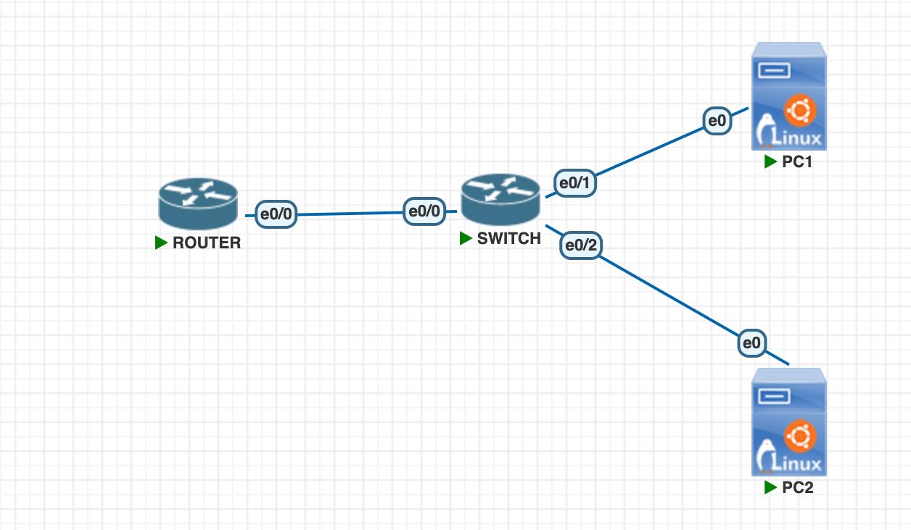

A topologia foi montada no PNetLab com 1 roteador (imagem IOL L3, interfaces Ethernet0/0 a Ethernet0/3), 1 switch Ethernet L2 e 2 hosts. As conexões feitas foram:

- Router `e0/0` → Switch `e0/0`
- Switch `e0/1` → PC1 `e0`
- Switch `e0/2` → PC2 `e0`

O acesso inicial ao roteador foi feito pelo console, através da aba `ROUTER` do terminal do PNetLab.

Duas adaptações em relação ao roteiro:

- em vez de VPCS, foram usados hosts Linux (Ubuntu) como PC1 e PC2, mantendo a mesma função lógica no cenário. Por isso o endereçamento dos hosts foi feito com os comandos `ip` do Linux, e não com o comando `ip 192.168.0.1/24 192.168.0.254` do VPCS;
- a interface LAN do roteador não é `g0/0` nem `f0/0`, e sim `Ethernet0/0`, que é a nomenclatura da imagem IOL utilizada. Os comandos foram adaptados conforme a própria observação do roteiro.

O switch não recebeu configuração: todas as portas permanecem na VLAN 1 por padrão, o que já é suficiente para que roteador e hosts fiquem no mesmo domínio de broadcast.

## Parte 2 - Endereçamento IP

O endereçamento utilizado foi o proposto no roteiro:

| Dispositivo | Interface | Endereço IP   | Máscara       | Gateway Padrão | Observação                    |
| ----------- | --------- | ------------- | ------------- | -------------- | ----------------------------- |
| Router      | Et0/0     | 192.168.0.254 | 255.255.255.0 | —              | Interface LAN do roteador     |
| PC 1        | eth0      | 192.168.0.1   | 255.255.255.0 | 192.168.0.254  | Host conectado ao switch      |
| PC 2        | eth0      | 192.168.0.2   | 255.255.255.0 | 192.168.0.254  | Host conectado ao switch      |
| Terminal    | Console   | —             | —             | —              | Acesso local via cabo console |

## Parte 3 - Configuração do roteador

### 1. Configuração inicial

Pelo console, entrei em modo privilegiado e em modo de configuração global, e defini o hostname, o banner de aviso, a senha de enable e a criptografia de senhas:

```bash
enable
configure terminal
hostname R1
no ip domain-lookup
banner motd #
Acesso Restrito. Somente Usuarios Cadastrados.
#
enable secret unb123
service password-encryption
```

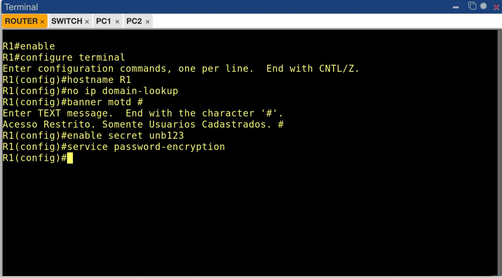

### 2. Linha de console, usuário local e SSH

Em seguida configurei a linha de console (senha, `login`, `logging synchronous` e `exec-timeout`), criei o usuário local `admin` com privilégio 15 e habilitei o SSH. Para o SSH funcionar foi necessário definir o `ip domain-name` e gerar o par de chaves RSA (usei 1024 bits, conforme o roteiro), já que a chave é obrigatória para o SSHv2:

```bash
line console 0
password cisco
login
logging synchronous
exec-timeout 10 0
exit
username admin privilege 15 secret Admin@123
ip domain-name unb.lab
crypto key generate rsa
1024
ip ssh version 2
line vty 0 4
login local
transport input ssh
exec-timeout 10 0
logging synchronous
exit
```

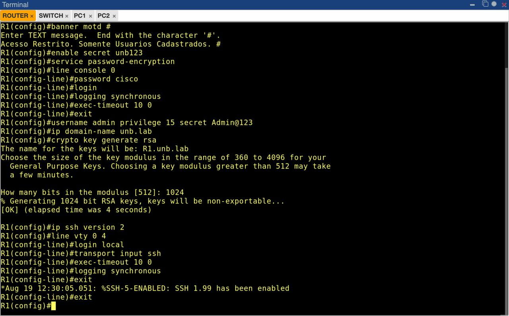

Assim que a chave foi gerada, o próprio IOS registrou no log: `%SSH-5-ENABLED: SSH 1.99 has been enabled`.

### 3. Configuração da interface LAN

Aqui houve dois erros no caminho que valem registro:

1. tentei entrar em `interface Ethernet0/0` direto do modo privilegiado (`R1#`), e o IOS respondeu `% Invalid input detected`, porque o comando `interface` só existe dentro do modo de configuração global;
2. digitei `ip address 192.168.0.254` sem a máscara e recebi `% Incomplete command.`, já que no IOS o endereço e a máscara são argumentos do mesmo comando.

Depois de corrigir, a configuração ficou assim:

```bash
configure terminal
interface Ethernet0/0
description LAN-PNETLAB
ip address 192.168.0.254 255.255.255.0
no shutdown
exit
end
copy running-config startup-config
```

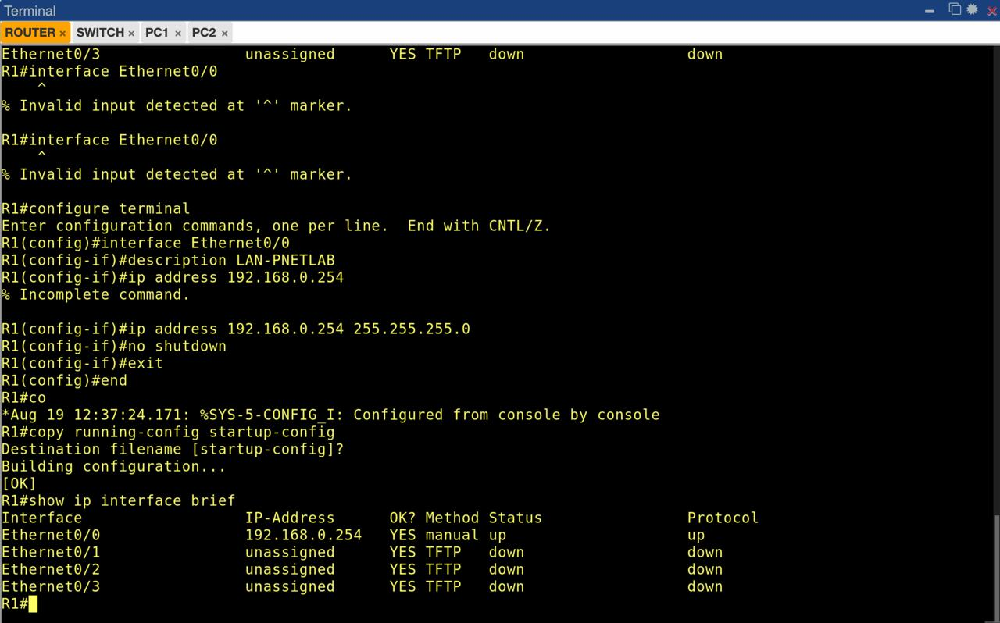

O `show ip interface brief` logo em seguida já mostra a `Ethernet0/0` com o IP `192.168.0.254`, método `manual`, status `up` e protocolo `up`, enquanto as demais interfaces continuam `unassigned` e `down`.

## Parte 4 - Configuração dos hosts

Os dois hosts Linux foram configurados na rede `192.168.0.0/24`, com o roteador (`192.168.0.254`) como gateway padrão.

Verificação no PC2 (nessa hora ainda errei o nome da interface, digitando `eht0`, e o sistema respondeu `Device "eht0" does not exist.`):

```bash
ip a show eth0
ip route
```

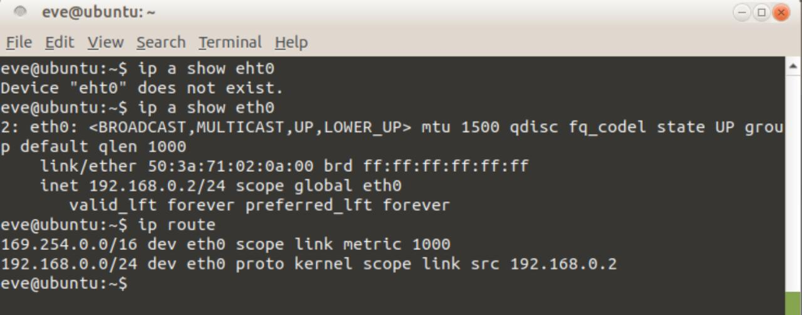

A saída confirma `inet 192.168.0.2/24 scope global eth0` com a interface em estado `UP`, e a tabela de rotas mostra a rota diretamente conectada `192.168.0.0/24 dev eth0 proto kernel scope link src 192.168.0.2`.

Vale observar aqui um ponto que se conecta com o Laboratório 1: como roteador e hosts estão todos na mesma rede `192.168.0.0/24`, a comunicação acontece pela rota diretamente conectada, sem passar pelo gateway. O gateway padrão só entraria em ação para destinos **fora** dessa rede, e é justamente por isso que ele será essencial nos próximos laboratórios, quando existirem redes remotas.

## Parte 5 - Testes de conectividade

### 1. PC1 → Roteador

Primeiro teste do PC1 para o gateway. Na primeira tentativa esqueci o número de pacotes depois do `-c` e o ping devolveu a mensagem de uso; corrigindo para `ping -c 4 192.168.0.254`, o resultado foi sucesso:

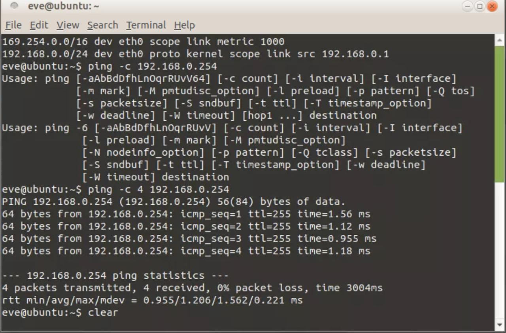

**Resultado:** 4 pacotes transmitidos, 4 recebidos, 0% de perda, RTT médio de 1,206 ms.

### 2. PC1 → Roteador e PC1 → PC2

```bash
ping -c 4 192.168.0.254
ping -c 4 192.168.0.2
```

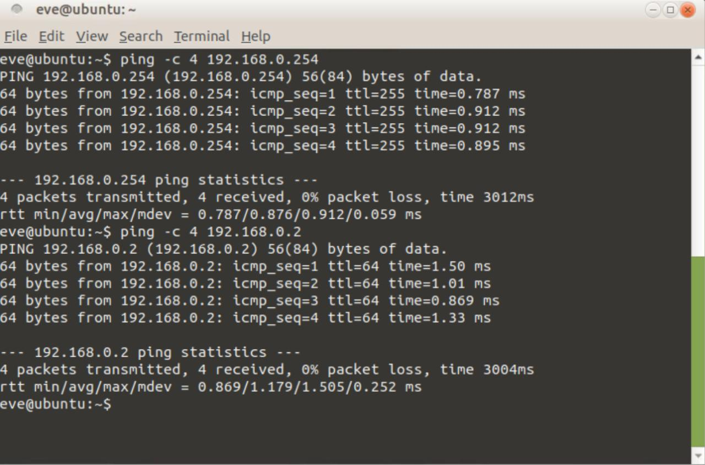

**Resultado:** sucesso nos dois casos, 0% de perda. RTT médio de 0,876 ms para o gateway e 1,179 ms para o PC2.

### 3. PC2 → Roteador e PC2 → PC1

```bash
ping -c 4 192.168.0.254
ping -c 4 192.168.0.1
```

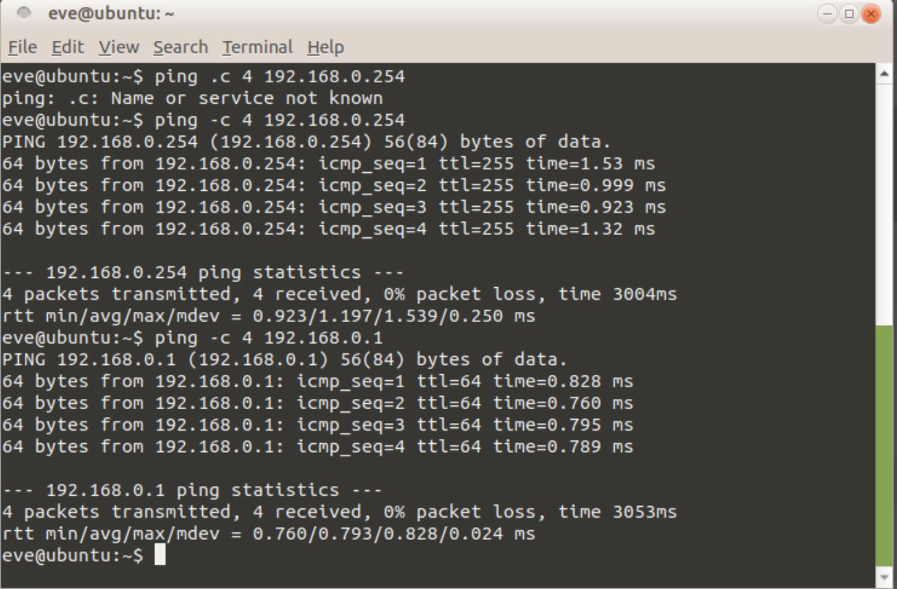

**Resultado:** sucesso nos dois casos, 0% de perda. RTT médio de 1,197 ms para o gateway e 0,793 ms para o PC1.

Um detalhe interessante nas saídas: o TTL das respostas do roteador é 255, enquanto o TTL das respostas do outro host Linux é 64. Isso acontece porque o TTL inicial é definido pelo sistema operacional que gera a resposta (IOS usa 255, Linux usa 64), e não porque o pacote passou por mais ou menos saltos. Como toda a comunicação é dentro da mesma LAN, nenhum pacote foi decrementado por roteamento.

## Parte 6 - Verificação no roteador

Após o login pelo console (que agora pede a senha configurada em `line console 0`), rodei os comandos de verificação:

```bash
show ip interface brief
show running-config
```

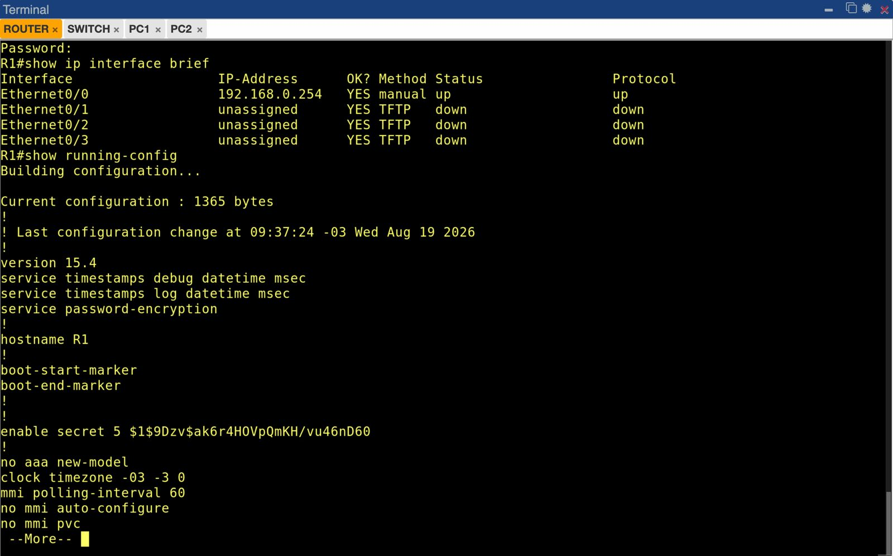

Pontos observados na saída:

- `Ethernet0/0` com `192.168.0.254`, `up/up`; demais interfaces `unassigned` e `down`;
- configuração atual com 1365 bytes, versão 15.4;
- `service password-encryption` ativo;
- `hostname R1` aplicado;
- `enable secret 5 $1$9Dzv$ak6r4HOVpQmKH/vu46nD60` — ou seja, a senha de enable aparece apenas como hash, e não em texto claro.

## Parte 7 - Acesso remoto via SSH

Do PC1, verifiquei primeiro se o cliente SSH existia e se a porta 22 do roteador estava aberta, e depois abri a sessão remota com o usuário local criado:

```bash
which ssh
ssh -V
nc -vz 192.168.0.254 22
ssh admin@192.168.0.254
```

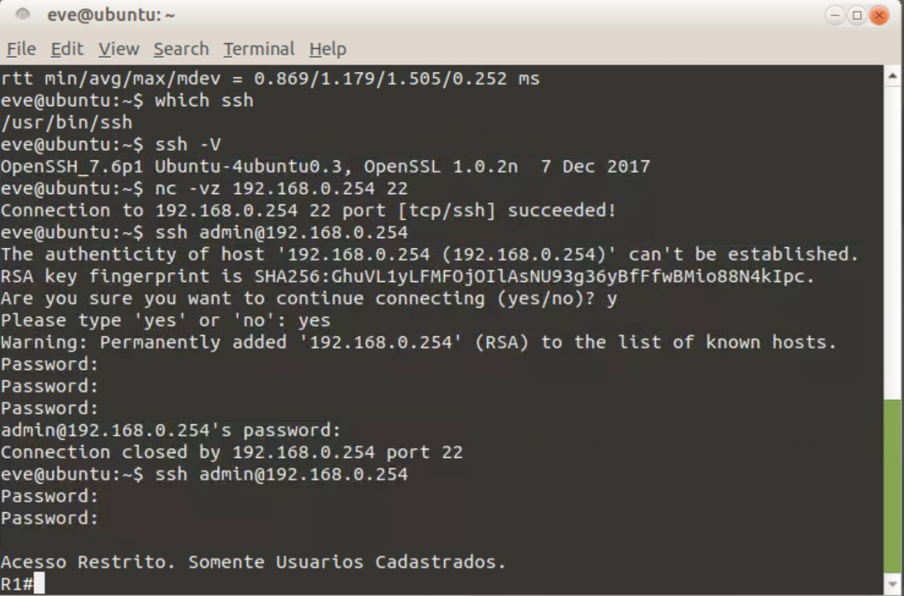

O `nc` retornou `Connection to 192.168.0.254 22 port [tcp/ssh] succeeded!`, confirmando que o serviço estava escutando. Na sequência, o cliente pediu a confirmação da chave do host (`RSA key fingerprint is SHA256:GhuVL1yLFMFOjOIlAsNU93g36yBfFfwBMio88N4kIpc`), que é a chave RSA gerada no passo 7.3. A primeira tentativa foi encerrada pelo roteador (`Connection closed by 192.168.0.254 port 22`) por causa de senhas erradas; na segunda tentativa a autenticação funcionou, o banner `Acesso Restrito. Somente Usuarios Cadastrados.` foi exibido e o prompt `R1#` apareceu já em modo privilegiado, como esperado para um usuário com `privilege 15`.

Com a sessão aberta, verifiquei as sessões ativas pelo console:

```bash
show users
show ssh
```

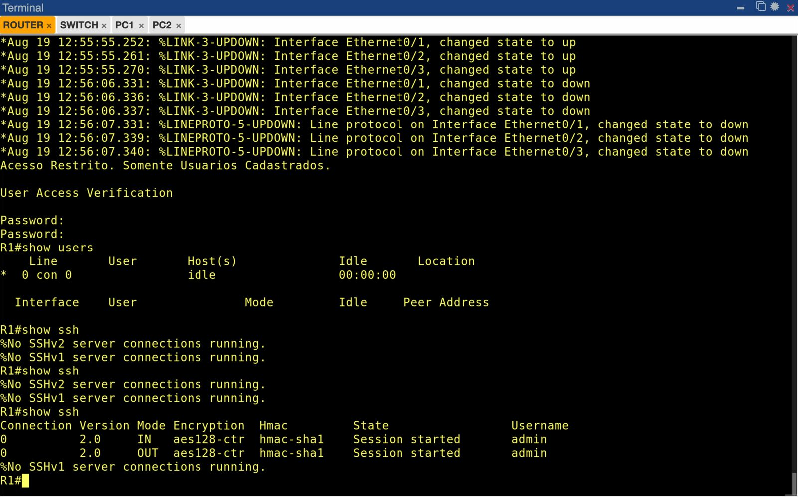

O `show ssh` mostra a conexão SSH versão 2.0, nos sentidos IN e OUT, com cifra `aes128-ctr` e HMAC `hmac-sha1`, estado `Session started` e usuário `admin`. Isso comprova que a sessão remota está de fato cifrada.

## Parte 8 - Questões para reflexão

**1. Qual a diferença entre acesso via console e acesso remoto pela rede?**

O console é um acesso físico e fora de banda: depende de estar ao lado do equipamento (ou, no PNetLab, da aba do terminal ligada à porta console) e funciona mesmo com o roteador sem nenhuma configuração de rede, com a interface desligada ou com a rede fora do ar. Foi por ele que consegui configurar o roteador antes de existir qualquer endereço IP. O acesso remoto (SSH) é em banda: só funciona depois que existe endereçamento IP, interface `up`, conectividade e autenticação configurada. Ele é muito mais prático para administração do dia a dia, mas cai junto com a rede — se a `Ethernet0/0` cair, sobra o console.

**2. Qual a função do comando `no ip domain-lookup` em laboratório?**

Por padrão, quando o IOS recebe uma palavra que não reconhece como comando, ele assume que é um hostname e tenta resolver o nome por DNS, o que trava o terminal por vários segundos até dar timeout. Em laboratório não existe servidor DNS, então o `no ip domain-lookup` desativa essa tradução e evita esse travamento a cada erro de digitação — algo bem útil, considerando os erros de digitação que cometi durante a prática.

**3. Por que o comando `enable secret` é preferível ao `enable password`?**

O `enable password` armazena a senha em texto claro no running-config, e mesmo com `service password-encryption` ela vira apenas uma criptografia tipo 7, que é reversível e pode ser desfeita em segundos por qualquer ferramenta online. Já o `enable secret` guarda um hash (tipo 5, MD5 com salt, no caso desta imagem), que não é reversível — só é possível tentar quebrá-lo por força bruta. Isso aparece direto na saída do `show running-config`: a senha `unb123` está registrada como `enable secret 5 $1$9Dzv$ak6r4HOVpQmKH/vu46nD60`.

**4. Por que o protocolo SSH é mais seguro que o Telnet?**

O Telnet transmite tudo em texto claro, incluindo usuário e senha, então qualquer captura de tráfego na LAN (um Wireshark no switch, por exemplo) já entrega as credenciais. O SSH cifra toda a sessão e ainda autentica o servidor pela chave do host, o que protege também contra alguém se passar pelo roteador. No laboratório isso ficou visível de duas formas: no cliente, com a verificação do fingerprint RSA antes de conectar, e no roteador, com o `show ssh` mostrando a sessão usando `aes128-ctr` e `hmac-sha1`. Foi também por isso que configurei `transport input ssh` nas linhas VTY, restringindo o acesso remoto e bloqueando o Telnet.

**5. O que ocorre se a interface não receber o comando `no shutdown`?**

A interface fica em estado `administratively down`, e o protocolo de linha fica `down` junto. Ela até guarda o endereço IP na configuração, mas não transmite nada: os hosts não alcançariam o gateway, a rede diretamente conectada não entraria na tabela de rotas do roteador e todos os pings falhariam. É exatamente o estado em que as interfaces `Ethernet0/1`, `0/2` e `0/3` aparecem no `show ip interface brief`, por não terem sido habilitadas.

## Conclusão

O laboratório cumpriu o objetivo de estabelecer a configuração básica de um roteador Cisco no PNetLab. Foi possível acessar o equipamento por console, aplicar os parâmetros de administração (hostname, banner, senhas, criptografia de senhas), configurar a interface LAN, salvar a configuração em `startup-config`, endereçar os hosts e validar a conectividade completa da LAN com `ping`, sem perda de pacotes. O acesso remoto via SSH também foi habilitado e testado com sucesso, com evidência da sessão cifrada no próprio roteador.

A diferença mais clara em relação ao Laboratório 1 é que aqui todos os dispositivos estão na mesma rede `192.168.0.0/24`, então não há decisão de roteamento envolvida: o switch apenas comuta quadros no mesmo domínio de broadcast e o roteador funciona como mais um host da LAN, ainda que já esteja no papel de gateway padrão. Esse papel só passa a ter efeito prático quando existirem redes distintas, que é o que os próximos laboratórios devem explorar com rotas estáticas e protocolos dinâmicos.
