# Relatório 3 - Laboratório 3
**Arthur Choi Braga - 242014300**

Laboratório 03 - PIM-DM em topologia controlada
Disciplina ENE0025 - Protocolos de Transporte e Roteamento

## Parte 1 - Setup da topologia

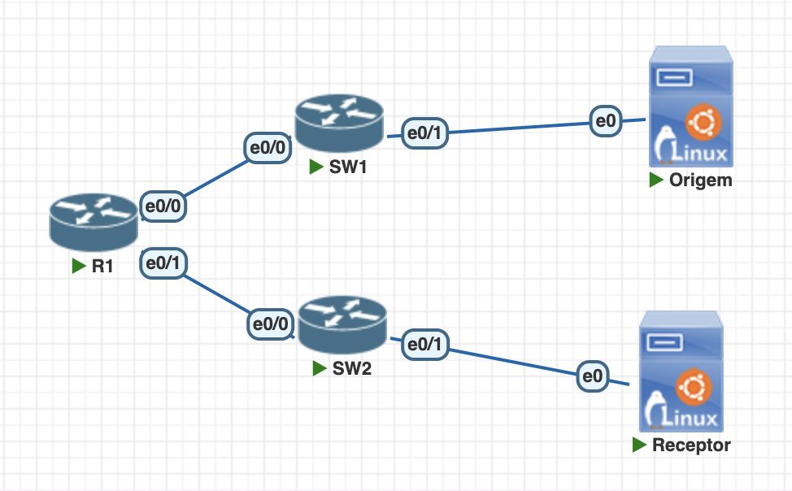

A topologia foi montada no PNetLab com 1 roteador (imagem IOL L3, interfaces `Ethernet0/0` a `Ethernet0/3`), 2 switches Ethernet L2 e 2 hosts Linux (Ubuntu), representando o host de origem e o host receptor, cada um em uma LAN distinta. As conexões feitas foram:

- Origem `e0` → SW1 `e0/1`
- SW1 `e0/0` → R1 `e0/0`
- Receptor `e0` → SW2 `e0/1`
- SW2 `e0/0` → R1 `e0/1`

O acesso ao roteador foi feito pelo console, pela aba `R1` do terminal do PNetLab.

Três adaptações em relação ao roteiro:

- a interface do roteador não é `g0/0` nem `g0/1`, e sim `Ethernet0/0` e `Ethernet0/1`, que é a nomenclatura da imagem IOL utilizada — a mesma adaptação já feita no Laboratório 2;
- em vez de hosts Linux minimalistas, foram usadas VMs Ubuntu como Origem e Receptor, o que permitiu instalar a ferramenta de geração de tráfego e usar `tcpdump` e os comandos `ip` do Linux para diagnóstico;
- o roteiro indica no item 15 imagens como IOSv ou CSR1000v para garantir suporte a multicast, mas a imagem IOL L3 15.4 aceitou tanto `ip multicast-routing` quanto `ip pim dense-mode` sem restrição, como se confirma nas saídas das partes 3 e 7.

Os switches não receberam configuração: todas as portas permanecem na VLAN 1 por padrão, o que basta para que cada switch funcione como um único domínio de broadcast ligando o host à interface correspondente do roteador. Diferente do Laboratório 2, aqui existem **duas** LANs separadas, e é justamente essa separação que faz o roteamento multicast ter sentido: o tráfego precisa atravessar o R1 para sair de uma rede e chegar à outra.

## Parte 2 - Endereçamento IP

O endereçamento utilizado foi o proposto no roteiro:

| Dispositivo   | Interface | Endereço IP   | Máscara       | Gateway Padrão | Observação                   |
| ------------- | --------- | ------------- | ------------- | -------------- | ---------------------------- |
| R1            | Et0/0     | 192.168.10.1  | 255.255.255.0 | —              | Interface da LAN de origem   |
| R1            | Et0/1     | 192.168.20.1  | 255.255.255.0 | —              | Interface da LAN do receptor |
| Host Origem   | eth0      | 192.168.10.10 | 255.255.255.0 | 192.168.10.1   | Emissor do fluxo multicast   |
| Host Receptor | eth0      | 192.168.20.10 | 255.255.255.0 | 192.168.20.1   | Receptor do fluxo multicast  |

**Grupo multicast:** `239.1.1.1` (endereço de classe D, faixa administrativamente escopada)
**Porta UDP de teste:** `5000`

## Parte 3 - Configuração do roteador

### 1. Configuração inicial e interfaces

Pelo console, defini o hostname, desativei a resolução de nomes e configurei as duas interfaces LAN com seus respectivos endereços, cada uma com uma descrição que identifica o papel dela no cenário:

```bash
enable
configure terminal
hostname R1
no ip domain-lookup
line con 0
 logging synchronous
 exec-timeout 0 0
 exit
interface Ethernet0/0
 description LAN-ORIGEM
 ip address 192.168.10.1 255.255.255.0
 no shutdown
 exit
interface Ethernet0/1
 description LAN-RECEPTOR
 ip address 192.168.20.1 255.255.255.0
 no shutdown
 exit
end
```

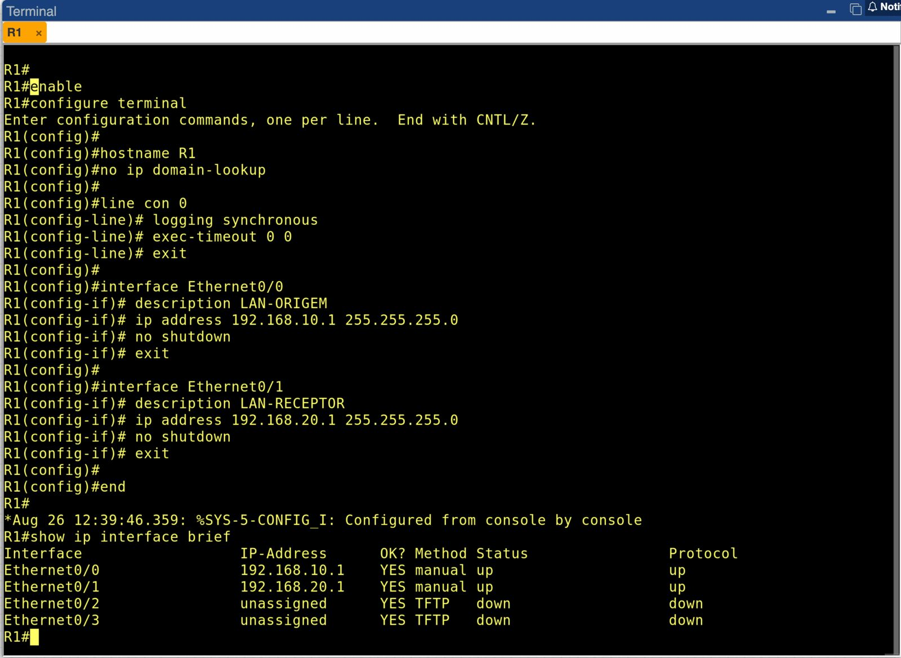

O `show ip interface brief` confirma `Ethernet0/0` com `192.168.10.1` e `Ethernet0/1` com `192.168.20.1`, ambas `up/up`, enquanto `Ethernet0/2` e `Ethernet0/3` permanecem `unassigned` e `down` por não terem sido usadas.

### 2. Habilitação do multicast e do PIM-DM

Em seguida habilitei o roteamento multicast globalmente e ativei o PIM em modo denso nas duas interfaces:

```bash
configure terminal
ip multicast-routing
interface Ethernet0/0
 ip pim dense-mode
 exit
interface Ethernet0/1
 ip pim dense-mode
 exit
end
copy running-config startup-config
```

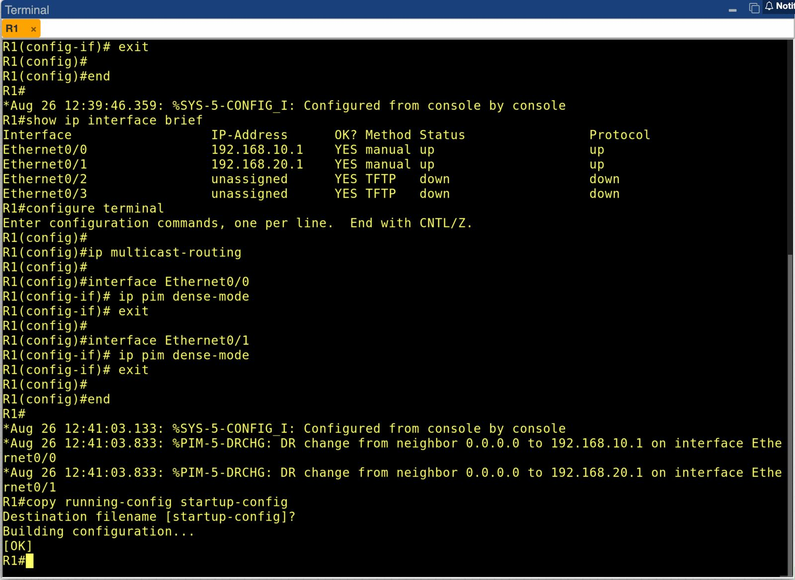

Vale destacar um detalhe da saída: assim que o `ip pim dense-mode` foi aplicado, o próprio IOS registrou no log duas mensagens `%PIM-5-DRCHG`, indicando a mudança do *Designated Router* de `0.0.0.0` para `192.168.10.1` em `Ethernet0/0` e para `192.168.20.1` em `Ethernet0/1`. Como o R1 é o único roteador PIM em cada segmento, ele se elege DR das duas LANs por ausência de concorrência — não há nenhum outro candidato para disputar a eleição.

A configuração foi salva com sucesso em `startup-config` (`Building configuration... [OK]`).

### 3. Verificação do PIM antes do tráfego

```bash
show ip pim interface
show ip igmp interface
show ip pim neighbor
```

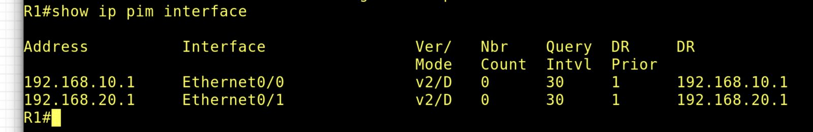

O `show ip pim interface` mostra as duas interfaces com `Ver/Mode` igual a **v2/D**, ou seja, PIM versão 2 operando em **Dense Mode**, exatamente o que o laboratório pede. O `Nbr Count` está em 0 nas duas, e o DR de cada segmento é o próprio endereço do R1.

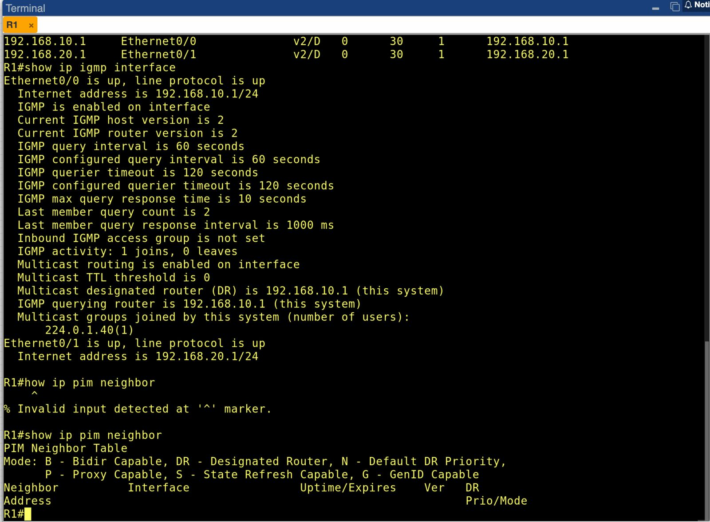

A `PIM Neighbor Table` aparece **vazia**, e isso é o resultado esperado nesta topologia: só existe um roteador PIM no cenário, então não há vizinho com quem estabelecer adjacência. Toda a árvore multicast aqui é formada entre o R1 e os hosts diretamente conectados, sem troca de mensagens PIM com outros roteadores.


## Parte 4 - Configuração dos hosts e validação unicast

Os hosts foram configurados com IP, gateway padrão e uma rota explícita para a faixa multicast, garantindo que os pacotes destinados a `224.0.0.0/4` saiam pela interface do laboratório:

**Host Origem**

```bash
sudo ip addr add 192.168.10.10/24 dev eth0
sudo ip link set eth0 up
sudo ip route add default via 192.168.10.1
sudo ip route add 224.0.0.0/4 dev eth0
```

**Host Receptor**

```bash
sudo ip addr add 192.168.20.10/24 dev eth0
sudo ip link set eth0 up
sudo ip route add default via 192.168.20.1
sudo ip route add 224.0.0.0/4 dev eth0
```

Antes de qualquer teste multicast, validei a base unicast a partir do Host Origem, porque o PIM depende diretamente da tabela unicast para o cálculo de RPF:

```bash
ping -c 4 192.168.10.1
ping -c 4 192.168.20.1
ping -c 4 192.168.20.10
```

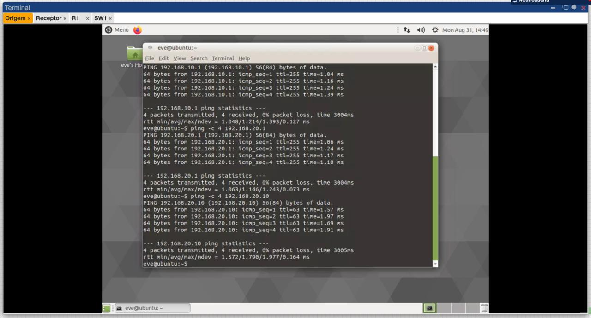

**Resultado:** sucesso nos três casos, 0% de perda. RTT médio de 1,214 ms para o gateway local, 1,146 ms para a interface remota do roteador e 1,790 ms para o host receptor.


## Parte 5 - Preparação da ferramenta de geração de tráfego

Para gerar e receber o fluxo multicast usei o `iperf`. Um ponto que exigiu atenção: a versão 3 do iperf **não suporta multicast** (o recurso foi removido pelos autores), então é necessário o pacote `iperf`, que corresponde à versão 2.

Como as VMs Ubuntu só enxergam o R1 dentro da topologia, elas não tinham saída para a internet para instalar o pacote. A solução foi anexar temporariamente um nó `Net` (Cloud) a uma segunda interface dos hosts, apenas durante a instalação:

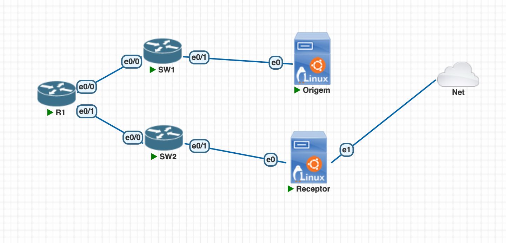

Com a interface adicional ativa, a instalação foi feita normalmente:

```bash
sudo apt update
sudo apt install -y iperf
```

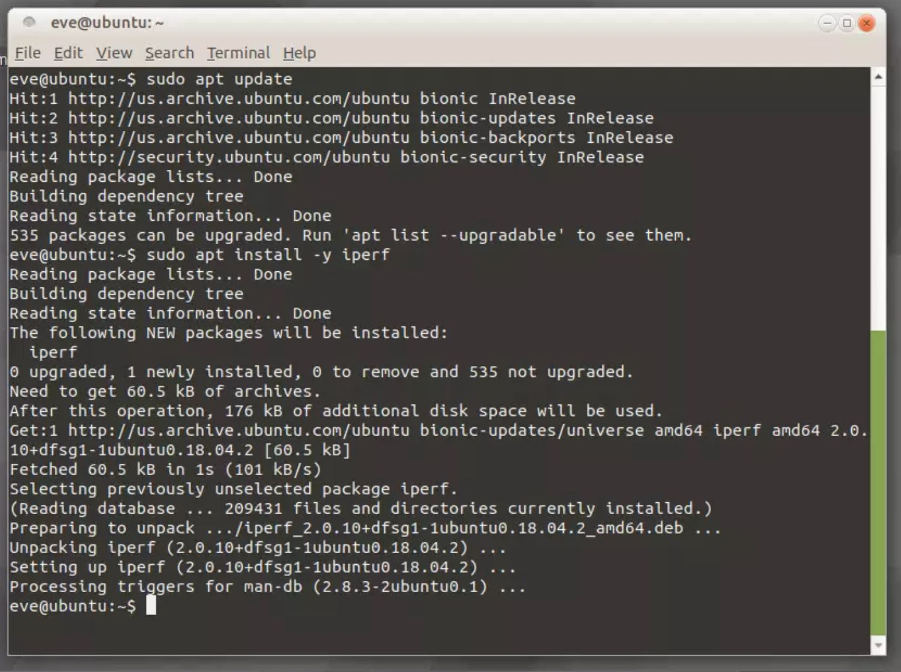

A saída confirma a instalação do pacote `iperf` na versão `2.0.10`, vindo do repositório *universe*. Concluída a instalação, o link com a Cloud foi retirado e a topologia voltou à configuração da Parte 1, para que nenhuma rota alternativa pudesse interferir na escolha de interface de saída do tráfego multicast.

## Parte 6 - Geração e recepção do tráfego multicast

A ordem de execução aqui é determinante e vale explicitar: em PIM-DM, a interface de saída só entra na árvore se houver interesse manifestado naquele segmento. Por isso o **receptor precisa ingressar no grupo antes** de o fluxo ser transmitido.

### 1. Host Receptor - ingresso no grupo

```bash
iperf -s -u -B 239.1.1.1 -p 5000 -i 1
```

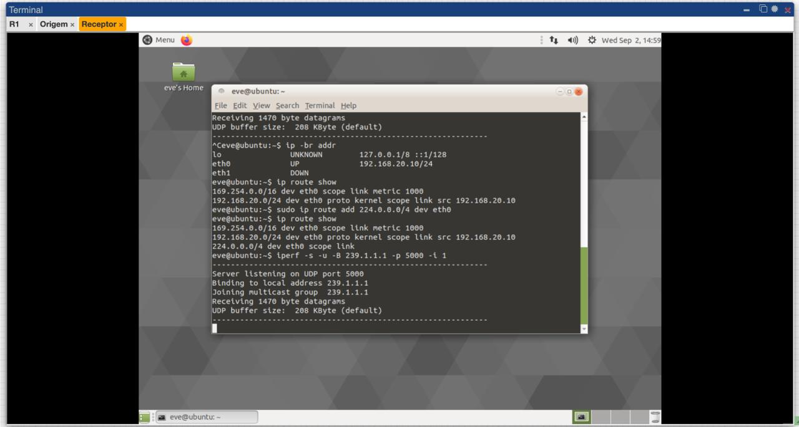

A saída do iperf descreve exatamente o que acontece na pilha do sistema: ele passa a escutar na porta UDP 5000, faz o *bind* no endereço local `239.1.1.1` e então executa o **join no grupo multicast**. É esse join que faz o kernel emitir um *IGMP Membership Report* na LAN 192.168.20.0/24.

O parâmetro `-B` é o que diferencia um servidor multicast de um servidor UDP comum: sem ele, o iperf apenas escutaria na porta, sem se inscrever em grupo nenhum, e o roteador nunca saberia que existe um interessado naquele segmento.

### 2. Roteador - confirmação da adesão IGMP

```bash
show ip igmp groups
```

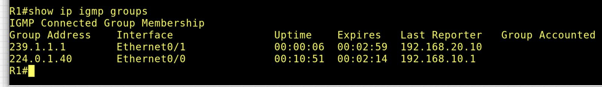

Esta é uma das evidências centrais do laboratório. A tabela agora traz duas linhas, e a comparação entre elas é bastante didática:

| Grupo        | Interface   | Last Reporter | Origem da entrada                        |
| ------------ | ----------- | ------------- | ---------------------------------------- |
| `239.1.1.1`  | Ethernet0/1 | 192.168.20.10 | Join IGMP enviado pelo **host receptor** |
| `224.0.1.40` | Ethernet0/0 | 192.168.10.1  | Grupo interno do próprio roteador        |

O que importa é a primeira linha: o grupo do laboratório foi aprendido na **interface correta** (`Ethernet0/1`, a LAN do receptor) e o *Last Reporter* é o **endereço do host receptor**, e não do roteador. Isso prova que o pacote IGMP saiu do host, atravessou o SW2 e foi processado pelo R1 — ou seja, o mecanismo de sinalização de interesse funcionou fim a fim.

O campo `Expires` mostra pouco menos de 3 minutos. Esse temporizador é a natureza *soft state* do IGMP: se o host parar de responder às queries periódicas do roteador, a entrada expira e o segmento deixa de receber o fluxo.

### 3. Host Origem - transmissão do fluxo

```bash
iperf -c 239.1.1.1 -u -T 32 -t 30 -i 1
```

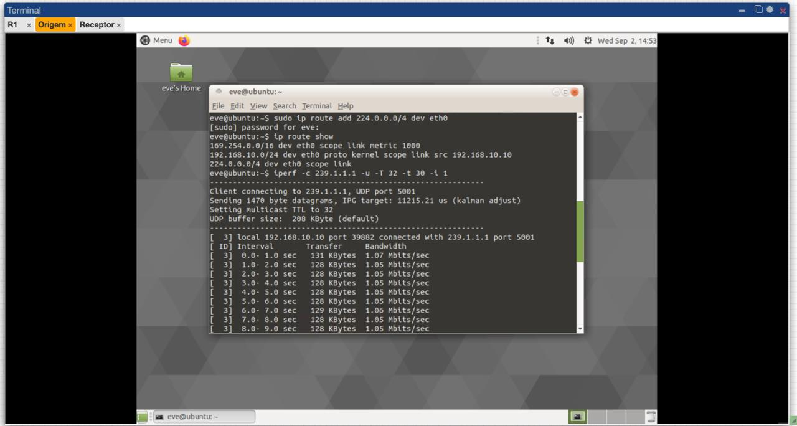

A saída do cliente confirma a conexão com o grupo `239.1.1.1`, o envio de datagramas de 1470 bytes e, principalmente, a linha `Setting multicast TTL to 32`, resultado do parâmetro `-T 32`.

Esse parâmetro é indispensável e merece destaque: o **TTL padrão para sockets multicast no Linux é 1**, o que confina o tráfego ao segmento local. Com TTL 1, o pacote chegaria ao R1 e seria descartado no decremento, sem nunca ser encaminhado para a outra LAN. Elevar o TTL para 32 é o que permite ao fluxo atravessar o roteador. É um contraste interessante com o unicast: no `ping` da Parte 4 o TTL nunca precisou ser ajustado, porque o valor padrão do sistema já era 64.

A transmissão manteve taxa estável em torno de 1,05 Mbit/s, com aproximadamente 128 KBytes transferidos por intervalo de 1 segundo.

## Parte 7 - Verificação da tabela multicast no roteador

```bash
show ip mroute
show ip mroute count
show ip mroute active
```

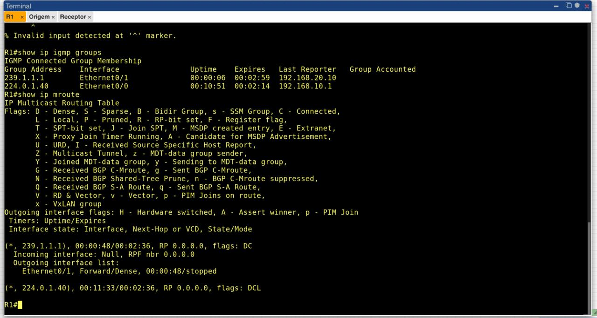

A tabela de roteamento multicast passou a conter a entrada do grupo do laboratório:

```
(*, 239.1.1.1), flags: DC
  Incoming interface: Null, RPF nbr 0.0.0.0
  Outgoing interface list:
    Ethernet0/1, Forward/Dense
```

Logo abaixo aparece também a entrada `(*, 224.0.1.40)` com flags `DCL`. A flag adicional `L` significa *Local*, isto é, o próprio roteador é membro daquele grupo — comportamento interno do IOS, sem relação com o cenário do laboratório. A comparação entre as duas entradas ajuda a fixar o significado das flags: `C` indica membro conectado na LAN, `L` indica que o membro é o próprio equipamento.

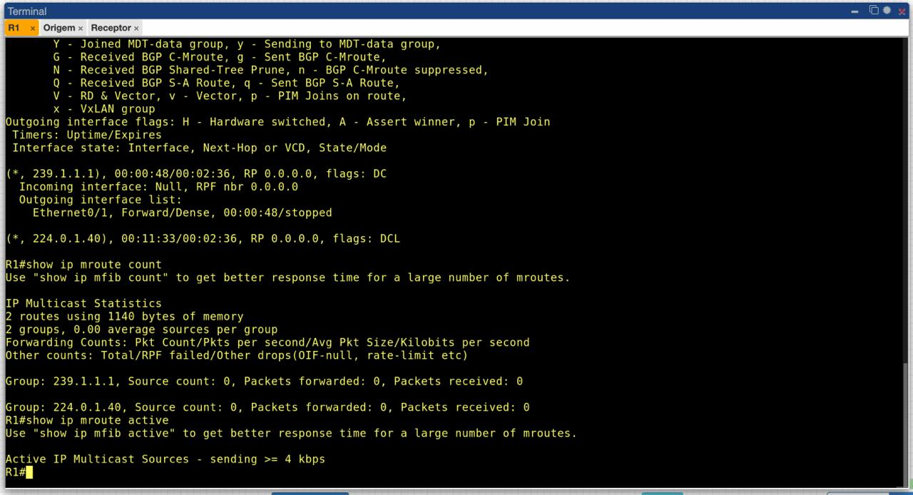

O `show ip mroute count` apresenta as estatísticas por grupo, listando os dois grupos presentes na tabela (`239.1.1.1` e `224.0.1.40`) com seus contadores de pacotes encaminhados e recebidos, e o consumo de memória do estado multicast (2 rotas, 1140 bytes). O `show ip mroute active` filtra apenas fontes com taxa igual ou superior a 4 kbps.

A entrada específica `(S, G)` — no caso, `(192.168.10.10, 239.1.1.1)` — é criada no instante em que o roteador efetivamente processa datagramas vindos da origem, e é nela que aparecem a interface de entrada validada por RPF e a flag `T` de SPT. Ela existe apenas enquanto há fluxo ativo: o PIM-DM mantém esse estado por temporizador e o descarta quando a transmissão cessa, o que fica visível nos campos `Uptime/Expires` de todas as entradas da tabela.


## Parte 8 - Questões para análise

**1. Por que o PIM é considerado independente do protocolo de roteamento unicast?**

Porque o PIM não constrói nem mantém uma tabela própria de alcançabilidade. Ele **consome** a tabela unicast que já existe — seja ela formada por rotas diretamente conectadas, rotas estáticas ou por RIP, OSPF, EIGRP — e a usa para um único fim: a verificação de **RPF**, isto é, dado o endereço da origem, qual é a interface do melhor caminho de volta até ela. A lógica de construção da árvore de distribuição (inundação, poda, enxerto, assert) é própria do PIM e não muda conforme o protocolo unicast subjacente.

Este laboratório é um bom exemplo disso: **nenhum protocolo de roteamento foi configurado**. O R1 conhece apenas as duas redes diretamente conectadas, exatamente como no Laboratório 1, e mesmo assim o PIM-DM opera normalmente. Ele não precisa saber *como* aquela informação chegou à tabela — precisa apenas que ela esteja lá.

**2. Qual a diferença entre tráfego unicast e multicast neste cenário?**

No teste unicast da Parte 4 (`ping 192.168.20.10`), o pacote tem como destino um host individual, e o R1 faz um encaminhamento 1:1 consultando a tabela unicast **pelo endereço de destino**.

No multicast, o destino `239.1.1.1` é um endereço de **grupo**, de classe D, que não pertence a nenhuma interface: nenhum host "tem" esse IP. A decisão do roteador se inverte — ele valida o pacote **pela origem** (RPF) e replica o tráfego segundo a lista de interfaces de saída construída a partir do IGMP e do PIM. Foi por isso que a `Ethernet0/1` entrou na OIL apenas depois do join do receptor, algo que não teria equivalente no encaminhamento unicast.

A diferença de escala é o argumento central do multicast: se houvesse dez receptores na rede `192.168.20.0/24`, o modelo unicast exigiria dez fluxos idênticos saindo da origem e atravessando o R1; o multicast exigiria **um único fluxo**, replicado pelo roteador apenas no ponto onde a topologia se divide.


**3. Qual a função do comando `ip multicast-routing`?**

É a chave global que habilita o encaminhamento multicast no roteador e cria a tabela de encaminhamento multicast (MRIB/MFIB) — a mesma que passou a ser exibida pelo `show ip mroute` na Parte 7. Sem ele, o roteador trata pacotes multicast recebidos como tráfego a ser descartado, sem replicá-los entre interfaces.

É um pré-requisito, não uma alternativa: `ip pim dense-mode` aplicado na interface sem o comando global não produz encaminhamento algum. A ordem seguida na Parte 3.2 reflete isso — primeiro a habilitação global, depois a ativação por interface. E o efeito do comando ficou visível de imediato: assim que ele foi aplicado junto ao PIM, o roteador passou a se inscrever no grupo `224.0.1.40` e a tabela multicast passou a existir.

**4. Por que o PIM-DM é uma boa escolha para uma primeira atividade prática?**

Porque dispensa infraestrutura de controle adicional. O PIM Sparse Mode exigiria definir um **Rendezvous Point** — estático, via Auto-RP ou via BSR — entender a árvore compartilhada `(*, G)` com raiz no RP, o processo de registro da origem e o *switchover* para a árvore de caminho mais curto `(S, G)`. São muitas variáveis para um primeiro contato, e cada uma delas é uma fonte de falha silenciosa.

O PIM-DM tem estado inicial simples: inunda por todas as interfaces habilitadas exceto aquela de entrada, e poda os ramos sem interesse. Isso apareceu direto nas saídas deste laboratório: o campo `RP 0.0.0.0` no `show ip mroute` mostra que nenhum ponto de encontro foi necessário, e o `show ip pim neighbor` vazio mostra que a árvore se formou sem nenhuma adjacência entre roteadores.

A contrapartida é o desperdício de banda: o estado de poda é *soft state* e expira periodicamente, fazendo a inundação se repetir. Numa topologia de dois segmentos isso é irrelevante; numa WAN com dezenas de ramos sem receptores, seria proibitivo — e é exatamente por isso que o PIM-SM domina os cenários reais.

**5. O que a tabela `show ip mroute` revela sobre o encaminhamento multicast?**

Ela revela o **estado da árvore de distribuição** por grupo, reunindo em uma única saída informações que vêm de duas fontes distintas:

- **quais grupos estão ativos** no roteador, distinguindo os do cenário (`239.1.1.1`) dos internos do próprio equipamento (`224.0.1.40`);
- a **interface de entrada** validada por RPF, ou seja, por onde o roteador aceita o tráfego de uma dada origem — informação que vem da **tabela unicast**;
- a **lista de interfaces de saída (OIL)** e o estado de cada uma (`Forward/Dense` ou `Prune/Dense`) — informação que vem do **IGMP e do PIM**;
- as **flags**, que sintetizam o modo de operação (`D`), a existência de membro conectado na LAN (`C`) ou no próprio equipamento (`L`), e o uso da árvore de caminho mais curto (`T`);
- os **temporizadores** `Uptime/Expires`, que evidenciam que todo esse estado é temporário e mantido por atualização periódica.

Em resumo, o `show ip mroute` é o ponto onde as duas metades do problema se encontram: o que o IGMP aprendeu dos hosts sobre *quem quer receber*, e o que a tabela unicast informou sobre *de onde o tráfego vem*.

## Conclusão

O laboratório cumpriu o objetivo de estabelecer o primeiro cenário de multicast IP roteado. Foi possível montar uma topologia com duas LANs distintas, configurar o endereçamento e validar a conectividade unicast fim a fim, habilitar o roteamento multicast e o PIM-DM nas interfaces do roteador, gerar tráfego para o grupo `239.1.1.1` e observar a formação do estado multicast no R1.

A evolução em relação aos laboratórios anteriores é clara. No Laboratório 1 a rede tinha uma única decisão de encaminhamento, tomada manualmente por rotas estáticas. No Laboratório 2 todos os dispositivos estavam na mesma rede, e o roteador funcionava praticamente como mais um host da LAN. Aqui, pela primeira vez, existem duas redes de verdade e um roteador tomando decisões de encaminhamento — e, mais que isso, um segundo plano de controle operando em paralelo ao unicast.

O ponto conceitual mais importante que a prática deixou é a **dependência entre os dois planos**. O PIM é chamado de *independent* por não se prender a nenhum protocolo unicast específico, mas ele é totalmente **dependente da existência** de uma tabela unicast consistente, porque é dela que sai a decisão de RPF. Se o `ping` da Parte 4 não tivesse funcionado, nada do que veio depois teria funcionado — e essa relação de causa e efeito ficou explícita na sequência de validações adotada.

O segundo ponto é o papel do host na formação da árvore. Diferente do unicast, onde o receptor é passivo, no multicast ele precisa **manifestar interesse**: foi o `Membership Report` disparado pelo `-B` do iperf que colocou a `Ethernet0/1` na lista de saída do roteador e produziu a flag `C` na tabela multicast. O roteador não adivinha onde estão os interessados — ele é informado por eles, via IGMP, e mantém essa informação apenas enquanto ela é renovada.